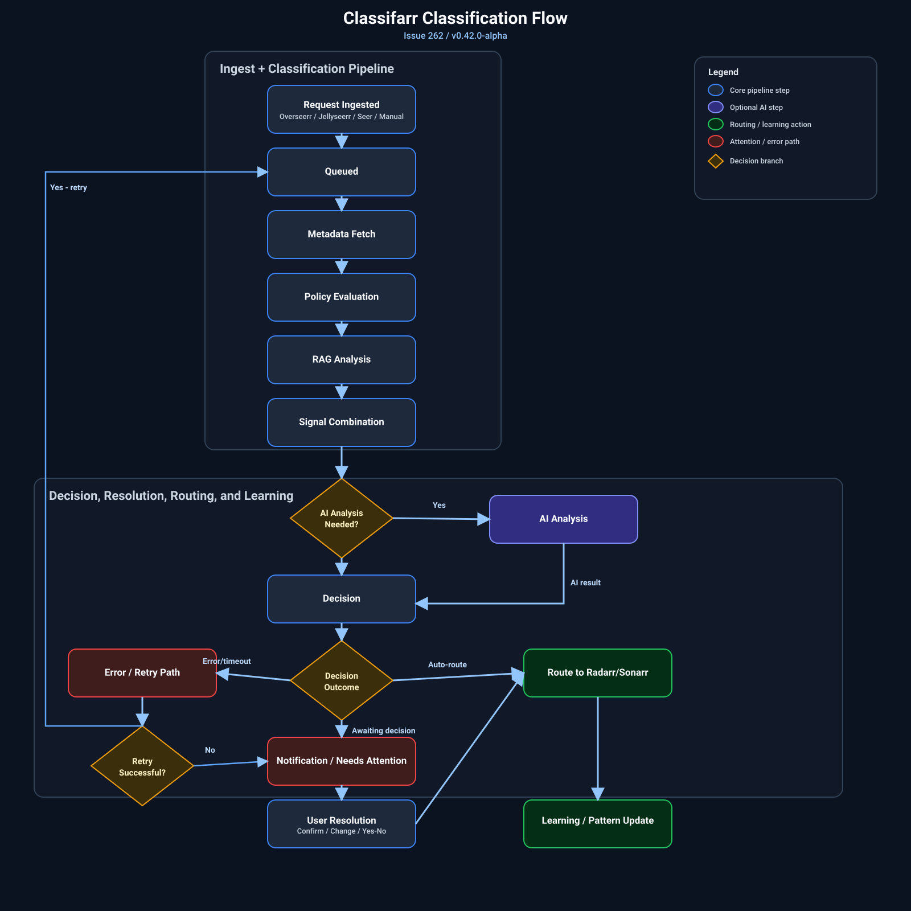

# Classifarr

Route every request to the right library, with policy-driven decisions you can actually trust.

Classifarr sits between your request sources and your media stack, classifies each item using policy + metadata + historical signals, and routes it to the correct Radarr/Sonarr destination.  
When confidence is low, it asks you for a decision instead of guessing.


## Why Classifarr

- No more manual sorting across multiple movie/TV libraries.
- Fewer bad AI guesses through policy-first classification.
- Clear operator control when uncertainty appears.
- One operational surface instead of bouncing between pages.

## What Makes It Different

Classifarr is built around an action-first **Command Center**:

- `Alerts`: urgent operational problems.
- `Processing`: active work, queue health, and progress.
- `Needs Attention`: policy questions and confirm/change decisions.
- `Errors`: retry and dismiss controls.
- `Recently Completed`: fast feedback loop.
- `Quick Add`: manual TMDB request flow.
- `Libraries` + `Today`: library-level and system-level visibility.

You still keep `/history` for historical audits and reclassification workflows.

## How Classification Works

This is the end-to-end pipeline from ingest to final routing:

<p align="center">
  
</p>

Direct diagram link: [`docs/assets/issue-262-classification-flow-v042.svg`](docs/assets/issue-262-classification-flow-v042.svg)

## Command Center Experience

The Command Center replaces fragmented dashboard workflows with one vertical, always-available operational view.

Core interaction model:

- See what needs action now.
- Resolve decisions inline (`Confirm`, `Change`, `Yes/No`).
- Retry failures without leaving the page.
- Track live progress with refresh-safe data behavior.

Global notification model:

- Bell icon with unread count.
- Unread/read grouping in panel.
- `Mark All Read` and per-item read actions.
- Full notifications page at `/notifications`.

## Quick Start

### Requirements

- Docker + Docker Compose
- TMDB API key
- OMDb API key (recommended)
- Media Server configured with Radarr/Sonarr mappings
- AI provider (Ollama, OpenAI, Gemini, or OpenRouter)

### Run with Docker Compose

```yaml
services:
  classifarr:
    image: ghcr.io/cloudbyday90/classifarr:latest
    container_name: classifarr
    ports:
      - "21324:21324"
    environment:
      - PUID=1000
      - PGID=1000
      - TZ=America/New_York
    volumes:
      - ./data:/app/data
      - /path/to/media:/data/media
    restart: unless-stopped
    extra_hosts:
      - "host.docker.internal:host-gateway"
```

```bash
docker compose up -d
```

Open `http://localhost:21324`.

### First Setup Order

1. Create admin account.
2. Configure Media Server and Radarr/Sonarr mappings.
3. Add TMDB and OMDb keys.
4. Configure AI provider and budget controls.
5. Optional: configure Discord integration.

## Daily Workflow

1. Open Command Center.
2. Clear critical `Alerts` first.
3. Resolve `Needs Attention` decisions.
4. Retry any `Errors`.
5. Monitor `Processing` and `Today` status.
6. Use `Quick Add` for manual requests.
7. Use `/history` for audits and reclassification.

## Configuration Model

Settings are intentionally scoped:

- `Media Server`: connections, mappings, sync behavior.
- `AI`: providers, model selection, budget controls.
- `Notifications`: Discord + in-app behavior.
- `Queue`: advanced maintenance operations.
- `Security`: auth and API key management.

Advanced queue maintenance remains in settings, not main Command Center actions:

- Reprocess completed
- Clear and re-sync

## API and Integrations

Swagger UI:

- `http://localhost:21324/api/docs`

Auth:

- Web UI uses JWT session auth.
- Automations use API keys with `X-API-Key`.

Common operational endpoints:

- `GET /api/libraries`
- `POST /api/media-server/sync`
- `GET /api/classification/pending`
- `POST /api/classification/pending/:id/resolve`
- `GET /api/classification/history`
- `GET /api/queue/live-stats`

API reference docs:

- `docs/api/README.md`
- `docs/api/classification.md`
- `docs/api/libraries.md`
- `docs/api/media-sync.md`
- `docs/api/system-health.md`

## Troubleshooting

### Policy question card is missing

- Confirm item is `awaiting_decision`.
- Verify pending payload includes `policy_question`.
- Use `Change` fallback if structured options are missing.

### Notifications look stale

- Refresh once to rehydrate unread count.
- Verify read-state endpoints are reachable.
- Confirm auth/session has not expired.

### Processing or enrichment seems stuck

- Check worker/AI status in `Today`.
- Trigger manual module refresh.
- Inspect queue and container logs for retries/timeouts.

### External metadata failures (OMDb/TMDB)

- Temporary upstream errors can retry automatically.
- Validate API keys and network connectivity.
- Investigate repeated non-transient failures in logs.
- Optional OMDb SSL tuning env vars: `OMDB_SSL_WARN_THROTTLE_MS`, `OMDB_SSL_BLOCK_MS`, `OMDB_SSL_RECOVERY_PROBE_MS`.

### Browser COOP/OAC warnings on LAN HTTP

- If you access Classifarr over plain HTTP on a private LAN IP (for example `http://192.168.x.x:21324`), browser console warnings about COOP/OAC can appear.
- Optional env var: set `SECURITY_HEADERS_STRICT=false` to disable those headers for HTTP LAN usage.
- Keep `SECURITY_HEADERS_STRICT=true` when running behind HTTPS (recommended default).

## Documentation

Core docs:

- `docs/issue-262-implementation-plan.md`
- `docs/issue-262-interface-design.md`
- `docs/architecture/policy-engine.md`
- `docs/presets/README.md`

Operational/docs references:

- `docs/testing/coverage.md`
- `docs/MIGRATION_SYSTEM.md`
- `docs/migrations.md`
- `docs/POSTGRESQL.md`
- `docs/nodejs-24-migration.md`

Setup guides:

- `PLEX_SETUP.md`
- `DISCORD_SETUP.md`
- `AUTHENTICATION.md`
- `unraid/README.md`

## Contributing

Contributors list: `CONTRIBUTORS.md`

For contributions, open an issue/PR with:

1. Problem statement
2. Reproduction details
3. Proposed implementation scope

## License

MIT License. See `LICENSE`.
