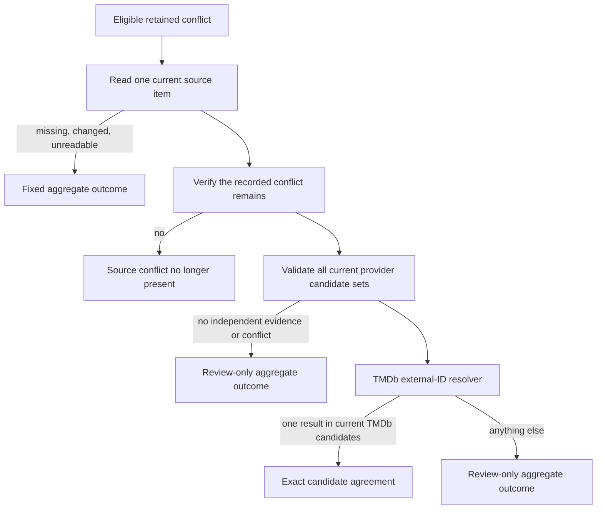

# Source identity evidence replay design

Date: 2026-09-09.

## Goal

Classifarr retains a small, privacy-bounded record when a media-server item
declares conflicting provider IDs. It correctly excludes that item from
identity authority, enrichment, classification, and routing. The next step is
to learn whether independent identifiers can ever prove one member of the
current source candidate set, without asking an operator to assemble source
data or accepting a source-specific preference rule.

This design adds an evidence replay only. It does not correct a source item,
write an inventory identity, remove an observation, select a semantic cohort,
invoke AI, or route media.

## Read-only contract

`runSourceIdentityExternalEvidenceReplay.mjs` uses
`default_transaction_read_only=on` before the database module is loaded. The
service issues one bounded `SELECT` for current observations and makes at most
32 single-item source reads, with at most eight from any one library. It
selects only observations that are all of the following:

- from an active library and active media server;
- from the matching, completed, full capture generation;
- from a capture with no omitted or uncapturable items;
- retained within the existing 30-day window; and
- marked `conflicting_provider_ids`.

The output contains only fixed aggregate outcome and resolver-reason counts.
It excludes library and server identifiers, source keys, titles, URLs,
credentials, fingerprints, candidate IDs, and provider response bodies.

The PostgreSQL reference documents that read-only transactions reject data
modification statements and DDL. That database-level guard complements the
service's lack of mutation code; neither property depends on a UI setting.

## Provider-neutral evidence adapter

The existing Plex, Emby, and Jellyfin adapters now implement the shared method
`getLibraryItemIdentityEvidence(url, apiKey, libraryExternalId, externalId)`.
It retrieves one current source item, verifies both source-item and
library membership, and returns only:

```text
{ mediaType, providerIds: { tmdb_id: [...], imdb_id: [...], tvdb_id: [...] } }
```

Provider-specific parsing remains inside the adapter. The replay service only
uses the shared contract, so it has no server order, library name, source URL,
or configuration preference. A future adapter can participate by implementing
the same narrow method.

All values remain in memory only. The result contract intentionally reports
fixed IDs such as `exact_candidate_agreement` and `review_required`, never the
underlying identifiers. This follows W3C data-minimization and purpose-
limitation guidance: transfer and retain only data required for the stated
identity-evidence purpose.

## Decision path



The existing generic resolver uses TMDb's Find by ID endpoint for IMDb and
TVDB evidence and requires all supplied independent IDs to agree. An exact
result is still only an evidence measurement in this release. A result outside
the current source TMDb candidate set is explicitly counted as
`resolved_not_current_candidate`; it cannot be turned into an automatic
correction.

## Alternatives

| Choice | Benefits | Costs | Decision |
| --- | --- | --- | --- |
| Full-library rescans | Reuses existing list endpoints | Extra load and changes while scanning make a result less attributable | Reject |
| Store every provider payload | Easy later inspection | Retains identifiers and source details without need | Reject |
| Take first or configured-preferred source ID | Low implementation cost | Provider- and configuration-specific, and converts ambiguity into a false fact | Reject |
| Bounded single-item replay with independent evidence | Low load, source-neutral, measurable, privacy-bounded | May yield no eligible automatic cases | Adopt |

## Recommendation stack

1. Keep the capture-time source conflict as an authority exclusion.
2. Measure only fresh, complete-capture conflicts through the bounded replay.
3. Treat every replay result as review-only until an exact-agreement rate and
   error profile support a separately designed compare-and-apply transition.
4. If that transition is later approved, bind it to the source key, capture
   generation, and a candidate-set digest, then atomically verify, persist,
   and remove the observation. A changed source must produce zero affected rows
   and be refreshed instead of being overwritten.

## Research

- [TMDb Find by ID](https://developer.themoviedb.org/reference/find-by-id)
  documents lookup by external identifier and its IMDb/TVDB support matrix.
- [PostgreSQL SET TRANSACTION](https://www.postgresql.org/docs/current/sql-set-transaction.html)
  defines the constraints of a read-only transaction.
- [W3C Privacy Principles](https://www.w3.org/TR/privacy-principles/) calls
  for data minimization and purpose limitation.
