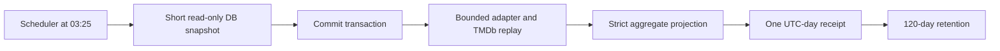

# Source identity evidence replay observation design

Date: 2026-09-10.

## Goal

Source-identity conflicts remain authority exclusions until the source is
repaired and a complete capture confirms the repair. The bounded external
evidence replay already measures whether an independent identifier supports a
current source candidate, but requiring an operator to remember a CLI replay
after every repair reintroduces the manual work the platform is intended to
remove.

This design makes that measurement a daily, provider-neutral observation. It
does not select an identity, modify a source item, update inventory identity,
select semantic evidence, invoke AI, or route media.

## Design

After application readiness, the scheduler registers two fixed daily tasks:

| Time (server scheduler time) | Task | Work |
| --- | --- | --- |
| 03:25 | `source-identity-evidence-replay-observation` | Capture one bounded replay receipt. |
| 03:26 | `source-identity-evidence-replay-observation-retention` | Delete observations older than 120 UTC days. |

There is deliberately no startup run. Restarting a replica therefore cannot
create surprise source-server or TMDb traffic. Separate session advisory locks
and scheduler no-overlap prevent duplicate work across replicas and in one
process.

The observation service has four ESM seams:

1. `sourceIdentityExternalEvidenceReplayReadService` starts a short
   `REPEATABLE READ READ ONLY` transaction and selects the existing fair,
   bounded conflict window.
2. `sourceIdentityExternalEvidenceReplay` runs only after that transaction
   commits. It reads at most 32 source items through the existing shared
   adapter contract and checks independent IDs with the existing TMDb resolver.
3. `sourceIdentityEvidenceReplayObservationContract` permits only fixed status,
   count, outcome, and reason fields. It rejects unknown fields and invalid
   totals before persistence.
4. `sourceIdentityEvidenceReplayObservationRepository` upserts one JSONB
   aggregate per UTC day and removes expired rows.

The replay still observes at most 12 rotating active libraries and at most
eight current conflicts per selected library. The daily row records coverage
counts and fixed outcome/reason codes only. It contains no item, source,
library, server, provider, candidate, URL, credential, configuration, policy,
AI, decision, or routing value.

## Failure handling

The underlying replay collapses provider and source failures to fixed codes.
Its failed status is persisted as `{ status: failed, summary: null }`, then
reported to the generic scheduler receipt mechanism as a task failure. Neither
path retains an exception message or a raw external response. A future daily
run overwrites only that day’s aggregate receipt, making recovery automatic
without a queue of provider-specific repair tasks.

The receipt cannot be a source of identity authority. In particular,
`exact_candidate_agreement` remains a measurement; it does not authorize a
compare-and-apply transition. The current measured profile has only two exact
agreements among 19 cases and 15 contradictory-evidence cases, so it does not
meet the prerequisite for any automatic resolution design.

## Alternatives

| Choice | Benefits | Costs | Decision |
| --- | --- | --- | --- |
| Require a manual CLI replay after repair | No scheduler change | Operators must remember timing and scope | Reject |
| Replay during startup | Fast first result | Restarts make external traffic unpredictable | Reject |
| Retain item/provider evidence for later inspection | More detailed diagnostics | Retains unnecessary identifiers and creates a manual queue | Reject |
| Automatically choose exact-agreement candidates | Fewer unresolved conflicts | Current measurement is too weak; stale evidence can be harmful | Reject |
| Daily bounded aggregate observation | Low fixed load, provider-neutral, automatic trend evidence | Does not diagnose or resolve one item | Adopt |

## Recommendation stack

1. Keep source conflicts as hard authority exclusions during capture and normal
   processing.
2. Observe only the fresh, complete-capture rotating window through the daily
   bounded replay.
3. Retain aggregate receipts for a fixed 120-day trend, with no operator
   setting or per-item work queue.
4. Consider a separate atomic compare-and-apply design only after a future
   frozen, independently labelled measurement shows a good error profile.
   Ambiguous evidence must go to review, never automatic routing.

## Research

- [PostgreSQL SET TRANSACTION](https://www.postgresql.org/docs/current/sql-set-transaction.html)
  defines transaction isolation and `READ ONLY`; the observation makes it the
  first command after `BEGIN` and ends that transaction before external I/O.
- [PostgreSQL transactions](https://www.postgresql.org/docs/current/tutorial-transactions.html)
  describes atomic all-or-nothing changes, which supports one receipt upsert
  without holding a transaction across network calls.
- [W3C Data on the Web Best Practices](https://www.w3.org/TR/dwbp/) recommends
  describing data quality and provenance; fixed outcomes plus a recorded
  replay version make the retained aggregate interpretable without retaining
  source identities.
- [W3C Privacy Principles](https://www.w3.org/TR/privacy-principles/) supports
  purpose limitation and data minimization, which the strict projection and
  bounded retention enforce.
