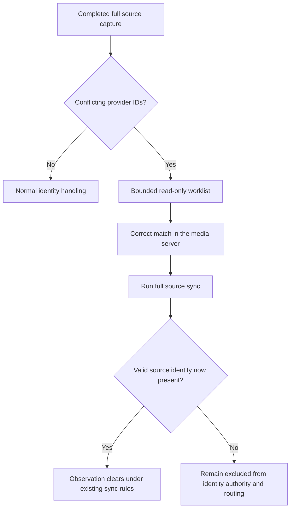

# Source repair worklist design

Date: 2026-09-10.

## Goal

The source-identity evidence replay measured only two exact candidate
agreements in 19 current conflicts. Fifteen cases still had contradictory
independent evidence, so the platform must not infer, write, or route an
identity. The practical next step is to remove the discovery and
transcription work from source repair while leaving the source media server as
the authority for its own match.

This change adds a read-only, source-agnostic repair worklist. It presents a
small, current set of source conflicts with a single fixed instruction:
correct the media-server match, then run a complete library sync. It never
selects an identifier, calls a provider, changes source metadata, writes an
inventory item, queues AI work, or routes media.

## Why the worklist is based on current conflicts

The replay deliberately produces aggregate-only output. It does not retain a
per-item outcome, source key, candidate set, or provider response. That makes
the 17 non-exact replay outcomes impossible to identify later without either
persisting more correlation data or repeating provider reads. Both choices
would expand retention or operational load beyond the replay's purpose.

The worklist therefore covers fresh `conflicting_provider_ids` observations
from a verified complete capture in its reported daily library window. It
includes the two exact-agreement measurements whenever their libraries fall in
that window. An exact agreement was evidence for a study, not authority to
alter a conflicted source record. A later full sync removes an item only when
the source itself becomes valid.

## Contract and bounds

`GET /api/libraries/source-repair-worklist` is authenticated, parameter-free,
rate-limited, and `Cache-Control: no-store`. `sourceRepairWorklist.mjs` uses a
single parameterized `SELECT` and returns:

```text
library.source_repair_worklist.v1
  status: complete | no_current_conflicts
  observedAt
  scope: fixed limits and fixed counts
  conflictCategories: fixed category IDs and selected counts
  entries[]: opaque fingerprint, library name, title/year/type,
             fixed issue/provider-field IDs, last-seen timestamp,
             fixed repair-action ID
```

The query accepts only observations that are from an active library, match its
active media server, are within the existing 30-day retention window, and
belong to the same generation as a completed full capture with no omitted or
uncapturable items. It selects a deterministic daily rotating window of 12
active libraries in library-ID order, at most eight entries per selected
library, and at most 32 entries in total. The daily window prevents a library
with a higher ID from being permanently excluded as the deployment grows.
Ordering first by each selected library's rank gives every library in the
bounded window a turn before selecting another item from one library.

The contract reports the active, selected, and excluded library counts. It
does not calculate a global eligible-conflict count: that would force every
read to traverse all active-library observations, contradicting the worklist's
bounded database cost. A `no_current_conflicts` response therefore means no
qualifying conflict exists in the reported daily worklist window, not an
assertion about excluded libraries.

The response excludes source keys, URLs, credentials, provider candidate
values, replay outcomes, media-server IDs, and configuration. The fingerprint
is an opaque UI key derived by the existing diagnostic helper; it is not a
source identifier. No schema migration is necessary: the worklist reads only
the bounded observation and capture state already used to preserve the source
identity safety boundary.

## Repair boundary



The UI intentionally contains no provider-specific repair link or configured
server URL. Different servers expose matching controls differently; displaying
one provider's workflow would make a generic observation contract dependent
on setup. Plex's official documentation is an example of this class of source
action: its Fix Match control lets an administrator inspect suggested source
matches. Classifarr keeps that repair in the server that owns the metadata.

## Accessibility and privacy

The worklist uses a status message, retry control, named region, `caption`,
column headers with `scope="col"`, and a row header with `scope="row"`.
Vue text interpolation keeps source titles as text rather than HTML. The W3C
WAI table guidance recommends captions and header relationships so assistive
technology can preserve row and column context.

The minimised payload follows W3C Privacy Principles: transfer and retain only
data necessary for the stated repair purpose and do not repurpose source data
for automatic classification or routing. The implementation makes one local
database read; it does not make the media-server or TMDb requests used by the
separate evidence replay. PostgreSQL's documented read-only transaction mode
remains available to callers that need an additional database guard; this
endpoint has no mutation SQL in either case.

## Alternatives

| Choice | Benefits | Costs | Decision |
| --- | --- | --- | --- |
| Persist replay outcomes per item | Could target only the prior 17 non-exact cases | Adds a correlated history that the aggregate replay intentionally avoids | Reject |
| Re-run source and TMDb evidence on each page view | Always current per-item evidence | Provider load, credentials in an interactive path, and no improvement to source authority | Reject |
| Pick a configured or first provider ID | Fewer manual steps | Source-specific, configuration-dependent, and unsafe under contradictory evidence | Reject |
| Bounded current-conflict worklist with source-side repair | Low-load, private, provider-neutral discovery | A source administrator still confirms the correct source match | Adopt |

## Recommendation stack

1. Keep conflicted source identities excluded from automatic authority,
   enrichment, classification, and routing.
2. Use the bounded worklist to identify the current source-side repair action
   without exposing or transcribing identifiers.
3. Verify every repair through the next completed full sync; only that source
   record can clear the conflict under the established sync contract.
4. Run a fresh aggregate replay only after the source repairs have produced a
   new complete capture. Consider an atomic compare-and-apply design only if
   its measured error profile materially improves.

## Research

- [W3C Privacy Principles](https://www.w3.org/TR/privacy-principles/) defines
  data minimization and purpose limitation for data handling.
- [W3C WAI Tables Tutorial](https://www.w3.org/WAI/tutorials/tables/) explains
  captions, header cells, and `scope` relationships for accessible data tables.
- [Plex Fix Match / Match support](https://support.plex.tv/articles/201018497-fix-match-match/)
  documents a source-server matching workflow; it is contextual research, not
  a provider-specific dependency of the UI or API.
- [PostgreSQL SET TRANSACTION](https://www.postgresql.org/docs/17/sql-set-transaction.html)
  describes the mutation statements a read-only transaction rejects.
