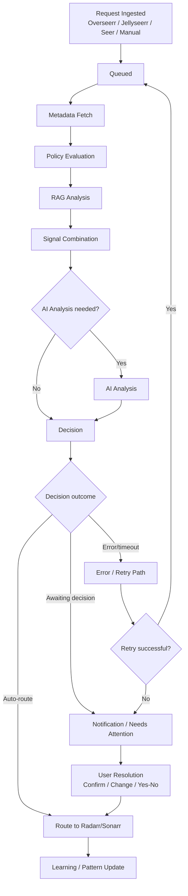

# Issue 262 Implementation Plan

Title: Classifarr Command Center Redesign (2026): Unify Actions, Reduce Noise, and Enhance Monitoring

Owner: Classifarr team
Status: **Complete** - Ready for v0.42.0-alpha release
Date: 2026-02-14
Release target: `v0.42.0-alpha`
Interface spec: `docs/issue-262-interface-design.md`
Task list: `docs/issue-262-task-list.md`
Release runbook: `docs/issue-262-release-runbook.md`
Best-practices log: `docs/issue-262-best-practices.md`

## Summary
Build a new Command Center experience that replaces fragmented Dashboard, Activity, and Queue workflows with one vertical, always-visible, action-first page. The redesign prioritizes user action handling, concise state visibility, and a global in-app notification system.

## Best-Practice Research Gate (Required)
Before implementation starts, capture and map online best-practice sources for the exact areas being implemented.

Required categories:
1. Action-first operational dashboard IA and empty-state patterns.
2. Notification center UX (unread/read grouping, bulk actions, open-target behavior).
3. Realtime SWR patterns (mutate-on-action, visibility-aware revalidation, cadence control).
4. Mobile operational UX (bottom sheet detail views, dense action rows, touch/accessibility constraints).
5. Progressive deprecation UX (legacy route compatibility and sunset behavior).
6. Feature-flag and staged rollout patterns for UI migration.
7. Notification fatigue controls (dedupe/grouping/severity noise controls).
8. Idempotent action API contracts and partial-failure behavior for bulk operations.
9. Queue backpressure and worker-concurrency visibility patterns.
10. Live-update accessibility patterns (`aria-live` and announcement priority controls).
11. Long-running action UX patterns (async status/progress/retry behavior).

Current status:
- Completed and mapped in `docs/issue-262-best-practices.md` as BP-001 through BP-021.

Execution requirements:
- Maintain citations and decision mapping in `docs/issue-262-best-practices.md`.
- Every phase below must apply Phase 0 research findings or explicitly document intentional deviations.
- If research findings conflict with locked Issue 262 scope, record the conflict and resolve it before coding.

## Requirements From Issue 262
1. Build a vertical Command Center with always-visible modules and clear empty states.
2. Surface urgent alerts first and keep actionable items at top of each module.
3. Remove duplicated information across Dashboard, Activity, and Queue.
4. Add global in-app notifications (bell, unread count, actionable links).
5. Keep detailed history/activity available, but out of the primary dashboard flow.
6. Ensure responsive behavior for mobile/tablet without losing critical actions.

## Related Child Issues
- #263 Page Consolidation
- #264 Today Module
- #265 Quick Add Module
- #266 Needs Attention Module
- #267 Mobile Layout
- #268 Recently Completed Module
- #269 Libraries Module
- #270 Errors Module
- #271 Alerts Module
- #272 Processing Module
- #273 Notification System

## Current State (Main Branch)
- Legacy routes still active: `Dashboard`, `Activity`, `Queue`.
- Sidebar and header IA still centered on the legacy page model.
- Backend has Discord notification config, but no complete in-app notifications API for bell/dropdown/read state flows.
- `app_notifications` persistence exists, but route-level surfacing and UX contract are incomplete for global notifications.
- Migration route `/migration` and legacy rule/migration UX references are still present in the app.

## Non-Goals (V1)
- No full rewrite of unrelated settings/history subsystems.
- No broad design-system refactor outside components touched by Command Center.
- No breaking API changes for existing integrations unless required and versioned.
- No removal of historical data views (History remains available).

## Implementation Strategy
Use a staged rollout to reduce risk:
1. Create Command Center shell and module scaffolding first.
2. Port action-heavy workflows before summary-only modules.
3. Add in-app notification contract and header integration.
4. Consolidate legacy pages only after parity checks pass.
5. Keep feature toggles and safe fallbacks until post-merge validation is complete.

## Execution Readiness and Governance (Locked)
Definition of Ready (implementation start gate):
- Planning artifacts are approved together:
  - `docs/issue-262-implementation-plan.md`
  - `docs/issue-262-interface-design.md`
  - `docs/issue-262-release-runbook.md`
  - `docs/issue-262-task-list.md`
- Child-workstream ownership exists for `#263` through `#273`.
- Staging validation path is ready before feature work closure:
  - API/contract gate
  - UI parity gate
  - mobile parity gate
  - rollback drill
- Post-release research items (`R-022` through `R-026`) are tracked but non-blocking for `v0.42.0-alpha`:
  - `docs/issue-262-post-release-research-backlog.md`

Critical path (execution order):
1. Alignment freeze (Phase 0).
2. Shell/routing/nav baseline (Phase 1).
3. Action-first core modules (Phase 2).
4. Notification contract and UI (Phase 4).
5. SWR/mobile/accessibility stabilization (task list Phase 5; plan Phase 6).
6. Legacy consolidation/deprecation completion (task list Phase 6; plan Phase 5).
7. Test gates and rollout gates (Phase 7).

Parallelization policy:
- Context modules (Phase 3) can run in parallel after Phase 1 baseline is stable.
- Documentation updates may begin early, but release docs cannot be marked complete before rollout gates pass.
- Deferred research tracks remain out of implementation critical path.

Execution timeline ownership:
- The operational owner/date matrix is maintained in `docs/issue-262-task-list.md` under `Ownership and Target Dates (Proposed)`.
- Child-issue ownership and scheduling (`#263` through `#273`) is maintained in `docs/issue-262-task-list.md` under `Child Issue Ownership Matrix (Proposed)`.
- Any approved schedule changes must be reflected in both docs in the same update.
- If date slippage impacts rollout gates, update `docs/issue-262-release-runbook.md` cutover sequencing notes before implementation resumes.

Scope change control:
- Any change to locked UX contracts (module order, action labels, notification semantics, policy-question parity) must update:
  - this plan,
  - `docs/issue-262-interface-design.md`,
  - `docs/issue-262-task-list.md`,
  - `docs/issue-262-release-runbook.md` (if rollout behavior is impacted).
- No implementation PR should merge with unresolved cross-document conflicts.

## OPENAI.md Alignment (Execution Constraints)

Issue 262 implementation follows the repository operating model in `OPENAI.md`.

3-layer execution model for this issue:
- Layer 1 (Directive): `docs/issue-262-implementation-plan.md` and `docs/issue-262-interface-design.md` are the source-of-truth directives for scope, UX contracts, and acceptance gates.
- Layer 2 (Orchestration): work is sequenced through child-issue checklists (`#263` to `#273`) with parity gates before legacy removal.
- Layer 3 (Execution): deterministic implementation/test scripts are preferred over manual repeated steps.

Tools-first and script usage:
- Check `execution/`, then `scripts/`, then `server/src/scripts/` before creating new automation.
- Only add new scripts when no existing tool satisfies the task.
- Keep temporary investigation artifacts in `.tmp/` and do not commit them.

Self-annealing and reliability loop:
- For each implementation regression: fix -> test -> update docs/checklists -> re-validate.
- Capture non-blocking follow-ups in `docs/interesting_findings.md` as needed.
- When API/provider constraints are discovered during rollout, update the relevant plan/design checklist items in this issue scope.

Contract and schema discipline:
- If API contract changes are introduced, update both server and client layers in the same work package:
  - `server/src/routes` + `server/src/services`
  - `client/src/api` + affected views/stores
- If schema changes are required, use new migrations in `database/migrations/` only.

Documentation obligations:
- README/release documentation updates for `v0.42.0-alpha` are part of required scope (not post-release cleanup).
- Detailed documentation tasks are defined in `Documentation and Release Hygiene (v0.42.0-alpha)` below.

## Dependency Baseline and Upgrade Plan (Online Verified 2026-02-12)

Scope note:
- Issue 262 does not require introducing new framework dependencies.
- Command Center, notifications, mobile UX, and SWR behavior can be implemented on the existing stack.

Runtime/tooling baseline:

| Item | Current in repo | Latest stable (online) | v0.42.0-alpha decision | Source |
|---|---|---|---|---|
| Node.js | `>=24.11.0` | `24.13.1` (latest LTS) | Raise engine floor to latest LTS patch in release branch | https://nodejs.org/dist/index.json |
| npm | `>=10.0.0` | `11.10.0` | Keep `>=10` for compatibility unless CI/runtime requires `11` | https://registry.npmjs.org/npm/latest |

Frontend dependency matrix:

| Package | Current | Latest stable (online) | v0.42.0-alpha decision | Source |
|---|---|---|---|---|
| `vue` | `^3.5.27` | `3.5.28` | Upgrade (safe patch) | https://registry.npmjs.org/vue/latest |
| `@vueuse/core` | `^14.2.0` | `14.2.1` | Upgrade (safe patch) | https://registry.npmjs.org/@vueuse%2Fcore/latest |
| `@vitejs/plugin-vue` | `^6.0.3` | `6.0.4` | Upgrade (safe patch) | https://registry.npmjs.org/@vitejs%2Fplugin-vue/latest |
| `vue-router` | `^5.0.2` | `5.0.2` | Already latest | https://registry.npmjs.org/vue-router/latest |
| `pinia` | `^3.0.4` | `3.0.4` | Already latest | https://registry.npmjs.org/pinia/latest |
| `vite` | `^7.3.1` | `7.3.1` | Already latest | https://registry.npmjs.org/vite/latest |
| `tailwindcss` | `^4.1.18` | `4.1.18` | Already latest | https://registry.npmjs.org/tailwindcss/latest |
| `@tailwindcss/postcss` | `^4.1.18` | `4.1.18` | Already latest | https://registry.npmjs.org/@tailwindcss%2Fpostcss/latest |
| `vitest` | `^4.0.18` | `4.0.18` | Already latest | https://registry.npmjs.org/vitest/latest |
| `axios` | `^1.13.5` | `1.13.5` | Already latest | https://registry.npmjs.org/axios/latest |
| `socket.io-client` | `^4.8.3` | `4.8.3` | Already latest | https://registry.npmjs.org/socket.io-client/latest |
| `@heroicons/vue` | `^2.2.0` | `2.2.0` | Already latest | https://registry.npmjs.org/@heroicons%2Fvue/latest |

Backend and test dependency matrix:

| Package | Current | Latest stable (online) | v0.42.0-alpha decision | Source |
|---|---|---|---|---|
| `express` | `^4.22.1` | `5.2.1` | Defer major upgrade to dedicated hardening issue (avoid scope/risk collision with Issue 262) | https://registry.npmjs.org/express/latest |
| `helmet` | `^7.2.0` | `8.1.0` | Defer major upgrade to dedicated hardening issue | https://registry.npmjs.org/helmet/latest |
| `eslint` | `9.39.2` | `10.0.0` | Defer major upgrade to dedicated lint/tooling issue | https://registry.npmjs.org/eslint/latest |
| `socket.io` | `^4.8.3` | `4.8.3` | Already latest | https://registry.npmjs.org/socket.io/latest |
| `pg` | `^8.18.0` | `8.18.0` | Already latest | https://registry.npmjs.org/pg/latest |
| `discord.js` | `^14.25.1` | `14.25.1` | Already latest | https://registry.npmjs.org/discord.js/latest |
| `express-rate-limit` | `^8.2.1` | `8.2.1` | Already latest | https://registry.npmjs.org/express-rate-limit/latest |
| `swagger-jsdoc` | `^6.2.8` | `6.2.8` | Already latest | https://registry.npmjs.org/swagger-jsdoc/latest |
| `swagger-ui-express` | `^5.0.1` | `5.0.1` | Already latest | https://registry.npmjs.org/swagger-ui-express/latest |
| `jest` | `^30.2.0` | `30.2.0` | Already latest | https://registry.npmjs.org/jest/latest |
| `supertest` | `^7.2.2` | `7.2.2` | Already latest | https://registry.npmjs.org/supertest/latest |
| `testcontainers` | `^11.11.0` | `11.11.0` | Already latest | https://registry.npmjs.org/testcontainers/latest |
| `@testcontainers/postgresql` | `^11.11.0` | `11.11.0` | Already latest | https://registry.npmjs.org/@testcontainers%2Fpostgresql/latest |

Dependency execution checklist:
- [ ] Apply safe non-breaking upgrades selected above (`vue`, `@vueuse/core`, `@vitejs/plugin-vue`, Node engine floor patch).
- [ ] Run full test matrix after dependency updates (`npm run test`, client/server CI test scripts).
- [ ] Record deferred major upgrades (`express`, `helmet`, `eslint`) as follow-up hardening issue(s) outside Issue 262 critical path.
- [ ] Update README/release notes with dependency baseline decisions for `v0.42.0-alpha`.

Deferred major-upgrade follow-up issue templates (ready to file):

### Template A - Express 5 Upgrade Hardening
- Title: `Dependency Hardening: Upgrade Express 4 -> 5 (post v0.42.0-alpha)`
- Goal: adopt Express 5 with no behavioral regressions in auth/routing/middleware.
- In scope:
  - Upgrade `express` and required companion middleware versions.
  - Validate route behavior (`server/src/routes/**`) and error-handling middleware.
  - Run and fix server integration tests.
- Out of scope:
  - Command Center UX or feature changes.
- Acceptance:
  - All server tests pass.
  - No route contract regressions for Command Center/notifications endpoints.
  - Release notes include migration notes for any breaking behavior.

### Template B - Helmet 8 Security Hardening
- Title: `Dependency Hardening: Upgrade Helmet 7 -> 8 (post v0.42.0-alpha)`
- Goal: adopt latest Helmet defaults without breaking UI, sockets, or swagger/docs surfaces.
- In scope:
  - Upgrade `helmet`.
  - Validate CSP/headers with Vite-built client and Socket.IO.
  - Validate swagger/docs accessibility under updated headers.
- Out of scope:
  - New security feature redesigns outside dependency update impact.
- Acceptance:
  - No blocked core UI/network paths due to header policy changes.
  - Security header behavior documented in release notes/changelog.

### Template C - ESLint 10 Tooling Upgrade
- Title: `Tooling Hardening: Upgrade ESLint 9 -> 10 (post v0.42.0-alpha)`
- Goal: adopt ESLint 10 while keeping lint/test workflows stable.
- In scope:
  - Upgrade `eslint` and adjust configs/rules if needed.
  - Validate lint scripts and CI behavior.
- Out of scope:
  - Broad code-style refactor unrelated to lint compatibility.
- Acceptance:
  - Lint/CI passes with stable rule outcomes.
  - Any rule changes are documented and intentionally reviewed.

## Phase Plan

## Phase 0 - Alignment and UI Input Freeze
Deliverables:
- Best-practices citation log completed in `docs/issue-262-best-practices.md` (sources + decision mappings).
- Final module order and visual hierarchy signed off.
- Module-level UX contracts documented (actions, empty states, error states, loading states).
- Confirmation of mobile behavior and breakpoints.

Acceptance criteria:
- No unresolved UX decisions block implementation sequencing.
- Module responsibilities are single-source (no duplicate data blocks planned).
- Research-derived defaults and rejected alternatives are documented and linked to plan/design decisions.

## Phase 1 - Command Center Shell and Routing
Frontend:
- Add `CommandCenter.vue` as the new primary landing view.
- Update router so `/` resolves to Command Center.
- Add section anchors/ids for deep links from notifications.
- Preserve existing routes temporarily for backward compatibility.

Navigation:
- Update sidebar/header labels to reflect Command Center IA.
- Add migration messaging for legacy route users.

Acceptance criteria:
- Users land on Command Center by default.
- Deep links to module anchors work.
- Shell/header/nav behavior matches locked research-backed IA decisions or approved deviations are documented.
- Detailed implementation, acceptance, and verification checklist is maintained in `docs/issue-262-task-list.md` under `Phase 1: Shell, Routing, and Navigation`.

## Phase 2 - Action-First Core Modules
Modules:
- Alerts (critical only, inline action hooks).
- Processing (active item, queue progress, idle state).
- Enrichment (visible only when in-progress).
- Needs Attention (confirm/change/confirm-all, no skip).
- Errors (retry/dismiss + bulk actions).

Backend/API work:
- Reuse existing queue/system endpoints where possible.
- Add thin aggregation/adapters only where existing endpoints cannot supply required shape.
- Normalize status payloads for deterministic UI rendering.

Acceptance criteria:
- All primary user actions can be completed from Command Center without visiting old pages.
- Empty/error/loading states are explicit for each module.
- Action-card layout and decision ergonomics align with documented best-practice decisions.
- Detailed implementation, acceptance, and verification checklist is maintained in `docs/issue-262-task-list.md` under `Phase 2: Action-First Core Modules`.

## Phase 3 - Context Modules
Modules:
- Recently Completed (last 5 items + History link).
- Quick Add (TMDB search + add/classify action).
- Libraries (per-library stats + manage link).
- Today (compact metrics + system health indicators).

Acceptance criteria:
- No duplicate summary panels remain from legacy dashboard cards.
- Data freshness and polling intervals are stable and documented.
- History/filter/discoverability behaviors align with research-backed defaults and lock decisions.
- Detailed implementation, acceptance, and verification checklist is maintained in `docs/issue-262-task-list.md` under `Phase 3: Context Modules and History Path`.

## Phase 4 - Global Notification System
Backend:
- Implement in-app notifications read model and endpoints:
  - list notifications
  - unread count
  - mark read
  - mark all read
  - dismiss/clear where applicable
- Map event producers to notification types:
  - awaiting decision
  - errors
  - system alerts
  - sync/enrichment completion
  - budget/service warnings

Frontend:
- Add bell icon and unread badge in global header.
- Add dropdown/panel grouped by unread/read.
- Clicking a notification routes to page/module anchor and marks read behavior per contract.

Data model:
- Reuse `app_notifications` where possible.
- Add migration only for missing fields required by read-state, routing target, and action metadata.

Acceptance criteria:
- Notifications persist across sessions.
- Read/unread state is deterministic and test-covered.
- Urgent alerts appear in Alerts module while full stream remains in notification center.
- Notification UX semantics (grouping, bulk actions, open-target behavior) match Phase 0 research mappings.
- Detailed implementation, acceptance, and verification checklist is maintained in `docs/issue-262-task-list.md` under `Phase 4: Notifications System`.

## Phase 5 - Legacy Page Consolidation
- Remove or deprecate legacy Dashboard/Activity/Queue-only widgets that are now duplicated.
- Keep redirects or guidance for old URLs.
- Update in-app links and docs references.

Acceptance criteria:
- No duplicate action surfaces remain.
- Legacy routes do not strand users.
- Legacy sunset behavior follows documented migration/deprecation best-practice decisions.
- Detailed implementation, acceptance, and verification checklist is maintained in `docs/issue-262-task-list.md` under `Phase 6: Consolidation and Deprecation`.

## Phase 6 - Mobile, Accessibility, and Performance
Mobile:
- Finalize stacked order and sticky affordances for critical actions.
- Validate tap targets and scroll-to-module behavior.

Accessibility:
- Keyboard navigation for module actions and notification panel.
- ARIA labels for status and action controls.
- Focus management on route/anchor navigation.

Performance:
- Polling budget and refresh cadence tuned to avoid excessive API chatter.
- Guard against re-render thrash in module polling.
- SWR-based revalidation replaces ad-hoc polling loops for Command Center-owned data.

Acceptance criteria:
- Core actions usable on mobile without hidden critical controls.
- WCAG-focused checks pass for updated views.
- SWR refresh/freshness semantics and mobile interaction patterns align with documented best-practice decisions.
- Detailed implementation, acceptance, and verification checklist is maintained in `docs/issue-262-task-list.md` under `Phase 5: SWR, Realtime, Mobile, and Accessibility`.

## Phase 7 - Testing and Rollout
Tests:
- Unit tests for each module state machine and action handlers.
- Integration tests for notification API and read-state flows.
- UI tests for navigation from notifications to module anchors.
- Regression tests for legacy route redirects and preserved history access.

Rollout:
- Ship behind feature flag if needed.
- Monitor action failure rate, notification latency, and frontend error rate.
- Remove temporary compatibility code after stabilization window.

Acceptance criteria:
- All child-issue acceptance criteria map to passing tests.
- No blocker regressions in queue processing or manual review workflows.
- Validation includes checks for research-backed UX contracts captured in `docs/issue-262-best-practices.md`.
- Detailed execution split is maintained in `docs/issue-262-task-list.md` under:
  - `Phase 7: Tests and Validation` (quality gate).
  - `Phase 8: Rollout and Documentation` (activation/documentation gate).

## API and Data Contract Worklist
- Define `CommandCenterSummary` response shape.
- Define notification payload shape (`id`, `type`, `title`, `message`, `severity`, `isRead`, `createdAt`, `targetPath`, `targetAnchor`, `actionMeta`).
- Lock notification `type` enum to the taxonomy in this document and reject unknown types in write paths.
- Document polling intervals per module and event-driven refresh triggers.
- Document action endpoint idempotency expectations for bulk actions.

## Documentation and Release Hygiene (v0.42.0-alpha)

README update scope (required):
- Update versioned README intro/badge/release references to align with `v0.42.0-alpha` release messaging.
- Replace legacy Dashboard/Activity/Queue-first wording with Command Center-first workflow language.
- Update navigation references to the locked sidebar IA and route visibility rules.
- Update operations guidance to reflect:
  - Needs Attention policy-question parity (including binary Yes/No behavior)
  - Command Center notifications panel and `/notifications` full view
  - Mobile behavior expectations (bottom-sheet Processing detail and responsive action rows)
- Remove or reframe README references that imply Migration/legacy rule tooling is an active primary workflow.
- Re-verify README links to active docs/routes after Issue 262 route/nav consolidation.

README overhaul mode (locked for v0.42.0-alpha):
- README is treated as a focused rewrite/restructure, not incremental patching only.
- Target outcome:
  - shorter top-level narrative,
  - current navigation and operations model,
  - archived/legacy details moved to linked docs where appropriate.
- Keep technical accuracy for setup/API/security sections while reducing duplicate/obsolete historical guidance.

README section-by-section checklist (execution-ready):

| README Section/Header | Required update for v0.42.0-alpha |
|---|---|
| Title + intro + badges (top of file) | Bump visible version references/badge to `v0.42.0-alpha`; update opening summary to Command Center-first UX language. |
| `## Features` | Add/refresh bullets for Command Center modules, in-app notifications (`bell` + `/notifications`), and mobile-ready action-first layout. |
| `## Architecture` | Replace legacy Dashboard/Activity/Queue framing with Command Center as primary operational surface. |
| `## System Health Monitoring` | Clarify operational visibility now appears in Command Center (`Alerts`, `Today`, notification flows), not only legacy pages. |
| `## How Classification Works (v0.37.0)` | Keep engine logic, but add current operator touchpoint: pending decisions resolved in Command Center `Needs Attention`. |
| `## Migration from v0.36.x` | Reframe as historical context; remove any instruction implying Migration Wizard/legacy migration page is still a primary in-app workflow. |
| `## Clear & Re-sync` | Keep settings-only advanced operations and explicitly state these are not Command Center primary actions. |
| `## sT Settings Overview` | Fix header typo (`sT` -> `Settings`), align category descriptions with current IA and settings ownership model. |
| `## Documentation` | Update docs index links/order to emphasize Command Center docs (`issue-262-*`) and current migration guides only. |
| `## Discord Bot` | Clarify Discord and Command Center parity for policy questions/Yes-No decisions. |
| `## API Documentation` | Add/refresh references for notification API and Command Center-related operational endpoints once finalized. |
| `## Troubleshooting` | Add Command Center-oriented troubleshooting paths (missing notifications, missing policy prompt card payload, mobile bottom-sheet behavior). |

README classification-flow chart requirement (reintroduced and updated):
- Add an explicit flow chart section in README (recommended under `## Architecture` or near `## How Classification Works`).
- Chart must show end-to-end lifecycle from ingest to routing and feedback, including operator decision paths.
- Required step nodes (locked):
  1. Request Ingested (Overseerr/Jellyseerr/Seer/manual)
  2. Queued
  3. Metadata Fetch
  4. Policy Evaluation
  5. RAG Analysis
  6. Signal Combination
  7. AI Analysis (when needed)
  8. Decision
  9. Notification / Needs Attention
  10. User Resolution (Confirm / Change / Yes-No)
  11. Route to Radarr/Sonarr
  12. Learning/Pattern Update
- Chart must include branching:
  - auto-route high-confidence path
  - awaiting-decision/manual resolution path
  - error/retry path
- Chart format:
  - prefer Mermaid flowchart for maintainability in GitHub rendering
  - provide a short text fallback summary directly below the chart
  - preferred polished diagram artifact for README overhaul: `docs/assets/issue-262-classification-flow-v042.svg`
- Chart acceptance:
  - node names align with locked phase terminology used in Command Center design/plan
  - no legacy-only route names (`Activity`, `Queue`) as primary operator path labels

Drop-in README diagram asset (SVG, polished):

```markdown

```

Drop-in README chart draft (Mermaid):



Drop-in README chart draft (Mermaid, enhanced visual variant):

```mermaid
flowchart LR
  subgraph INGEST["Ingest"]
    A[Request Ingested<br/>Overseerr / Jellyseerr / Seer / Manual]
    B[Queued]
  end

  subgraph ANALYSIS["Classification Pipeline"]
    C[Metadata Fetch]
    D[Policy Evaluation]
    E[RAG Analysis]
    F[Signal Combination]
    G{AI Analysis needed?}
    I[AI Analysis]
    H[Decision]
  end

  subgraph OUTCOME["Outcome and Resolution"]
    J{Decision outcome}
    K[Route to Radarr/Sonarr]
    L[Notification / Needs Attention]
    M[User Resolution<br/>Confirm / Change / Yes-No]
    N[Error / Retry Path]
    O{Retry successful?}
    P[Learning / Pattern Update]
  end

  A --> B --> C --> D --> E --> F --> G
  G -- "No" --> H
  G -- "Yes" --> I --> H
  H --> J
  J -- "Auto-route" --> K --> P
  J -- "Awaiting decision" --> L --> M --> K
  J -- "Error/timeout" --> N --> O
  O -- "Yes" --> B
  O -- "No" --> L

  classDef ingest fill:#dbeafe,stroke:#2563eb,color:#0f172a,stroke-width:1px;
  classDef pipeline fill:#e2e8f0,stroke:#334155,color:#0f172a,stroke-width:1px;
  classDef decision fill:#fef3c7,stroke:#d97706,color:#0f172a,stroke-width:1px;
  classDef action fill:#dcfce7,stroke:#16a34a,color:#0f172a,stroke-width:1px;
  classDef attention fill:#fee2e2,stroke:#ef4444,color:#0f172a,stroke-width:1px;

  class A,B ingest;
  class C,D,E,F,I,H pipeline;
  class G,J,O decision;
  class K,P action;
  class L,M,N attention;
```



Drop-in README chart fallback summary (text):
- Request enters queue, metadata is fetched, then policy + RAG + signal combination produce a decision.
- AI analysis runs only when needed before final decision.
- High-confidence decisions auto-route to Radarr/Sonarr.
- Ambiguous decisions create a notification and appear in Needs Attention for user resolution (Confirm/Change/Yes-No).
- Errors enter retry flow; successful retry returns to queued processing, otherwise item returns to user decision flow.
- Successful routing updates learning/pattern signals.

README v0.42.0-alpha rewrite scaffold (draft):

Target top-level structure:
1. `# Classifarr`
2. `## What Classifarr Does`
3. `## Command Center Overview (v0.42.0-alpha)`
4. `## Classification Flow`
5. `## Quick Start`
6. `## Configuration`
7. `## Notifications and Decision Workflows`
8. `## API and Integrations`
9. `## Troubleshooting`
10. `## Documentation Index`
11. `## Contributing`
12. `## License`

Section transformation map:

| Current README area | v0.42.0-alpha action |
|---|---|
| Intro + badges + long historical framing | Keep, shorten, and make Command Center-first. |
| `## Features` | Keep but trim to concise feature bullets grouped by user outcome. |
| `## Architecture` + old flow text | Keep and place updated Mermaid chart under `## Classification Flow`. |
| `## System Health Monitoring` | Keep, tie explicitly to Command Center modules and notifications. |
| `## How Classification Works (v0.37.0)` | Keep core logic, remove stale version framing in heading/title. |
| `## Policy Builder` + policy/tuning sections | Keep, but consolidate repetitive narrative and move deep details to docs links. |
| `## Migration from v0.36.x` | Move to historical/archived subsection or docs link; do not keep as primary path. |
| `## Clear & Re-sync` + advanced queue actions | Keep in settings/operations context, not primary getting-started flow. |
| `## sT Settings Overview` | Rename/fix typo to `## Settings Overview`; align with current IA ownership. |
| `## Discord Bot` | Keep; explicitly describe parity with Command Center decisions. |
| `## API Documentation` | Keep concise summary + link to full API docs. |
| `## Deployment` + `## Troubleshooting` | Keep and refresh examples/version references. |

Authoring constraints for rewrite:
- Keep README focused on user/operator path; push long reference detail to `docs/`.
- Avoid duplicate explanations that already exist in migration or API reference docs.
- Use stable terminology from Issue 262 design/plan (`Command Center`, `Needs Attention`, `Processing`, `Notifications`).
- Remove primary-path references to deprecated/legacy pages (`Activity`, `Queue`, `Migration`) except explicitly labeled compatibility notes.

Release documentation touchpoints:
- Add `v0.42.0-alpha` entry in `CHANGELOG.md` for Issue 262 scope.
- Add/update `RELEASE_NOTES.md` summary for Command Center consolidation, notifications, mobile updates, and deprecations.

Acceptance gate:
- README reflects Command Center-era IA and does not direct users to deprecated primary flows.
- Release docs (`CHANGELOG.md`, `RELEASE_NOTES.md`) clearly call out Issue 262 changes and migration expectations.
- README overhaul is completed with reintroduced classification flow chart and validated against locked phase/action terminology.

## Action Parity Checklist (Locked)
This checklist captures currently available actions under Libraries, Request, Activity, and Queue that must be preserved or intentionally deferred in Command Center.

| Source Area | Existing Action | Command Center Mapping | V1 Decision |
|---|---|---|---|
| Libraries | `Sync Libraries` | Libraries module section action | Include |
| Libraries | Open library detail | Libraries row click / quick action `[⚙]` | Include |
| Libraries | Setup CTA (`Configure Media Server`) | Show only when Media Server is not configured or Radarr/Sonarr mappings are missing | Include (conditional) |
| Libraries | Per-library sync/settings from detail page | `[⚙]` quick action + `Manage Libraries` route | Include |
| Request | Search TMDB | Quick Add input | Include |
| Request | Submit manual request/classify | Quick Add `Add` action | Include |
| Request | Recent manual requests list | Optional expansion under Quick Add | Deferred (v1.1+) |
| Activity | Manual refresh | Per-module refresh controls (where needed) via SWR `mutate` | Include |
| Activity | `Process Retry Queue` (Tavily retry backlog) | Enrichment module conditional action | Include |
| Activity | `Classifying...` phased progress component | Keep Activity page phased classifying block (8-step phase order + stepper/details) until Command Center Processing parity is validated | Include (transition) |
| Activity | Up Next queue preview | Processing module secondary list | Include |
| Queue | Resolve awaiting decision (policy options/manual select) | Needs Attention confirm/change flows | Include |
| Queue | `generate_rule: true` on resolve path | Needs Attention resolve payload parity | Include |
| Queue | Retry failed task | Errors item action `Retry` | Include |
| Queue | Cancel pending task | Processing/Pending secondary action | Include |
| Queue | Manual classify pending task | Needs Attention/Processing overflow action | Include |
| Queue | Retry all failed | Errors bulk action `Retry All` | Include |
| Queue | Clear failed | Errors bulk action `Dismiss All` | Include |
| Queue | Cancel all pending | Processing bulk action | Include |
| Queue Settings | Reprocess completed | Keep in Settings advanced operations | Deferred (settings-only) |
| Queue Settings | Clear and resync | Keep in Settings advanced operations | Deferred (settings-only) |

## Section-to-Implementation Binding (Audit 2026-02-12)
This section ties each Command Center action to current implementation, expected behavior, and remaining work.

Status legend:
- `Implemented`: backend endpoint and current UI behavior already exist (may be on legacy pages).
- `Partial`: endpoint exists but Command Center wiring/UX contract is incomplete.
- `Missing`: required endpoint or required UI behavior does not exist yet.

### Global Header and Notifications

| Action | Intended behavior | Current implementation | Status | Required implementation |
|---|---|---|---|---|
| Open bell panel (`[🔔 N]`) | Opens unread-first notification panel from global header | Header currently renders breadcrumbs/time only; no bell/account controls in `client/src/components/layout/Header.vue` | Missing | Add bell badge + panel trigger in header; bind unread count source |
| Mark all read | Marks all unread notifications read and updates badge immediately | No in-app notifications API routes mounted in `server/src/routes/api.js`; only settings notifications config exists (`/api/settings/notifications`) | Missing | Add notification feed/read-state API (`list`, `unreadCount`, `markAllRead`) and wire panel action |
| View all notifications | Opens `/notifications` full list with filters/actions | Route not present in `client/src/router/index.js` | Missing | Add `/notifications` view + router entry + pagination/filter behavior |
| Row open target | Opens target module/page anchor and marks read | Notification target contract exists in plan only; no active UI wiring | Missing | Add `targetPath`/`targetAnchor` handling and navigation behavior |
| Row mark read/unread | Toggle read-state without navigation | No notification read endpoint implemented | Missing | Add `markRead`/`markUnread` API and row action handlers |
| Row dismiss | Dismiss dismissible notifications | Legacy banner calls `/notifications/:id/dismiss` but route is not implemented; component currently tolerates 404 (`client/src/components/MappingWarningBanner.vue`) | Missing | Implement dismiss endpoint and remove 404 fallback dependency |

### Alerts Module

| Action | Intended behavior | Current implementation | Status | Required implementation |
|---|---|---|---|---|
| Reconnect | Recover from disconnected Radarr/Sonarr/Plex state from Alert row | Health/status APIs exist: `/api/system/health`, `/api/system/status`, `/api/system/health/refresh` | Partial | Define reconnect action contract (retry connection check vs route to Media Server settings) and wire button |
| View Usage | Open AI budget usage details from budget alert | API client exposes `getAIUsage()` -> `/api/settings/ai/usage` in `client/src/api/index.js` | Partial | Wire alert action to existing usage view/route and add failure handling |
| Show critical alerts only | Keep actionable, high-severity items visible on page | Health data exists; no dedicated Command Center alerts adapter yet | Partial | Build alert selector/priority rules from health + notification events |

### Processing Module

| Action | Intended behavior | Current implementation | Status | Required implementation |
|---|---|---|---|---|
| Active item + queue summary | Show current item, percent, queue pending, overall totals | Queue live stats endpoint exists: `/api/queue/live-stats` | Partial | Map payload into Command Center card shape + empty-state copy lock |
| Classifying phase summary | Show current phase/step and completion status | Phase endpoint exists: `/api/classification/progress`; Activity listens to sockets `classification:progress` and `classification:complete` | Partial | Reuse existing phase service in Command Center card and align with locked 8-step wording |
| Card detail expansion | Clicking card opens phase-by-phase detail view | Detailed behavior exists conceptually in design, not in Command Center UI yet | Missing | Add selectable processing card + expanded detail panel (desktop inline, mobile sheet) |
| Cancel pending item | Cancel selected pending queue item | Endpoint exists: `POST /api/queue/task/:id/cancel` | Implemented | Reuse existing API call in Command Center action row |
| Cancel all pending | Cancel all pending queue tasks | Endpoint exists: `POST /api/queue/cancel-all-pending` | Implemented | Wire bulk button and post-action SWR revalidation |
| Manual classify | Trigger manual classification for pending task | Endpoint exists: `POST /api/queue/tasks/:id/classify` | Implemented | Expose in Command Center overflow/action row where task context exists |
| Refresh | Manually refresh module data | Legacy views use mixed polling/socket patterns | Partial | Implement SWR `mutate` button semantics for Processing data |
| Up Next preview | Show top pending items list | Endpoint exists: `GET /api/queue/pending` | Implemented | Bind to secondary list in module |

### Enrichment Module

| Action | Intended behavior | Current implementation | Status | Required implementation |
|---|---|---|---|---|
| Show enrichment progress | Render progress bar + OMDb/Tavily totals while running | Data can be derived from queue/live stats + existing activity state | Partial | Normalize payload for locked text format and visibility rules |
| Process Retry Queue | Process Tavily/metadata retry backlog | Endpoint exists: `POST /api/queue/retry-process`; stats: `GET /api/queue/retry-stats`; Activity has action button | Implemented | Move action into Command Center module and trigger SWR refresh |
| Conditional visibility | Hide only under defined complete/disabled conditions | Rule defined in design only | Missing | Implement deterministic show/hide state logic + tests |

### Needs Attention Module

| Action | Intended behavior | Current implementation | Status | Required implementation |
|---|---|---|---|---|
| List pending decisions | Show items awaiting user resolution | Endpoint exists: `GET /api/classification/pending` | Implemented | Map response into command card layout (title/confidence/reason) |
| Policy question parity (Discord) | Show the same AI/policy question prompt text and answer choices shown in Discord | `policy_question` payload already returned by `GET /api/classification/pending`; legacy Queue view renders it | Partial | Render `policy_question.question`, `why_uncertain`, and option buttons directly in Command Center Needs Attention cards |
| Yes/No parity (Discord verify style) | Render binary decision buttons when pending options are effectively Yes/No | Discord has dedicated `verify_yes/verify_no`; web currently renders generic options only in Queue | Missing | Add binary option rendering rule in Command Center (if two options map to Yes/No, render explicit `[Yes] [No]`; otherwise render option list) |
| Confirm decision | Apply proposed mapping quickly | Endpoint exists: `POST /api/classification/pending/:id/resolve` | Implemented | Reuse existing queue resolution payload and toasts |
| Change decision | Choose different target and resolve | Queue view already supports option/manual select before resolve | Implemented | Reuse modal/select behavior in module |
| Confirm all | Bulk-apply all pending with defaults | No bulk resolve endpoint | Missing | Add backend bulk resolve route or safe client loop contract with idempotency + partial-failure handling |
| Rule generation parity | Keep `generate_rule: true` behavior | Present in existing resolve payload path | Implemented | Keep this field explicit in Command Center resolver |

### Errors Module

| Action | Intended behavior | Current implementation | Status | Required implementation |
|---|---|---|---|---|
| List failed items | Show failed classification rows with reason/time | Endpoint exists: `GET /api/queue/failed` | Implemented | Map row shape to command module |
| Retry item | Retry one failed task | Endpoint exists: `POST /api/queue/task/:id/retry` | Implemented | Reuse in per-row action |
| Dismiss item | Remove one failed task from list | No per-item dismiss endpoint | Missing | Add item-level dismiss API or explicitly change UI to remove per-item dismiss from spec |
| Retry all | Retry all failed tasks | Endpoint exists: `POST /api/queue/retry-all-failed` | Implemented | Wire bulk button + revalidate |
| Dismiss all | Clear failed queue set | Endpoint exists: `POST /api/queue/clear-failed` | Implemented | Wire bulk button + revalidate |

### Recently Completed Module

| Action | Intended behavior | Current implementation | Status | Required implementation |
|---|---|---|---|---|
| Show latest 5 | Show most recent completed classifications | History endpoint exists: `GET /api/classification/history` | Partial | Add Command Center list adapter for 5-item slice with relative age |
| View Full History | Navigate to full history page | Route exists: `/history` and legacy Dashboard link uses it | Implemented | Reuse same route action |

### Quick Add Module

| Action | Intended behavior | Current implementation | Status | Required implementation |
|---|---|---|---|---|
| Search TMDB | Search titles inline from Command Center | Endpoint exists: `GET /api/requests/search` | Implemented | Reuse existing Manual Request search contract |
| Add request | Submit manual request and enqueue classification flow | Endpoint exists: `POST /api/requests/submit` | Implemented | Reuse Manual Request submit path in compact inline form |
| Show recent requests (deferred) | Optional recent requests below input | Endpoint exists: `GET /api/requests/recent` | Deferred | Keep out of v1 module shell per parity table |

### Libraries Module

| Action | Intended behavior | Current implementation | Status | Required implementation |
|---|---|---|---|---|
| Show per-library stats | Name, item count, today delta, auto % | Library list endpoint exists: `GET /api/libraries` | Partial | Confirm required fields in API response; add adapter if needed |
| Open library detail | Open per-library management page | Route exists: `/libraries/:id` and row click exists in `client/src/views/Libraries.vue` | Implemented | Reuse click-through behavior |
| Manage libraries | Navigate to libraries page | Route exists: `/libraries` | Implemented | Reuse footer link |
| Sync libraries | Trigger global media sync | Endpoint exists: `POST /api/media-server/sync`; used in Libraries page | Implemented | Decide whether action is section-level or delegated to Manage page |
| Per-library sync | Trigger one-library sync | Endpoint exists: `POST /api/libraries/:id/sync` | Implemented | Expose via row action/secondary menu |
| Row `[⚙]` quick actions | Inline per-library action menu | Not currently represented as a Command Center row action | Missing | Add quick-action menu contract and permitted actions |
| Configure Media Server CTA (conditional) | Show only when media server or Radarr/Sonarr mappings are incomplete | Conditional setup CTA behavior already exists in Libraries view | Implemented | Reuse same gating logic in Command Center module |

### Today Module

| Action | Intended behavior | Current implementation | Status | Required implementation |
|---|---|---|---|---|
| Show summary stats | Classified count, confidence, manual count | Values available via `/api/queue/live-stats` (`today` payload) | Partial | Bind and lock copy format in module |
| Show service health badges | AI and worker status in compact line | Health/status data exists (`/api/system/health`, `/api/system/status`) | Partial | Normalize health mapping and badge colors in module |

### SWR/Realtime Binding by Module

| Module | Current state | Required state in Command Center |
|---|---|---|
| Dashboard data | Uses `useSWR` already | Reuse key strategy and migrate cards to Command Center cache keys |
| Activity data | Mixed polling + WebSocket events | Move to SWR-first with socket-triggered `mutate` for fast updates |
| Queue data | Legacy route-local fetch patterns | Consolidate under Command Center SWR ownership and shared cache keys |
| Notifications | No SWR feed (no feed API) | Add SWR keys for list/count and mutate after mark-read/dismiss actions |

### Implementation Backlog Extract (Action-Critical)
1. Add in-app notifications API + `/notifications` route/view + header bell wiring.
2. Add missing bulk/per-item action endpoints required by locked UI (`Confirm All`, per-item `Dismiss`) or explicitly adjust locked UI contract.
3. Build Command Center module adapters that map existing queue/classification/libraries/request endpoints into the locked module payloads.
4. Migrate module refresh behavior to SWR (`mutate` on action, visibility-aware polling, idle cadence downgrade).
5. Preserve Activity `Classifying...` phased view during migration and remove duplication only after Processing parity tests pass.

## One-Off Reliability Follow-Up (Motorvalley Incident, 2026-02-12)

This issue is tracked as a focused reliability hardening slice that must be completed alongside Issue 262 implementation, without expanding Command Center scope beyond operational visibility and guardrails.

Observed incident summary:
- Active TV libraries did not include a dedicated `Racing` library, but clarification text suggested a racing-specific destination.
- RAG second-pass stage gate ran (`policy_prompt_select`) but did not upgrade/adopt a pass2 candidate.
- `AIResponseParser` logged malformed/truncated output and the flow remained on baseline/manual resolution.
- OMDb returned transient `520` and retried; not primary incident cause, but relevant for operational resilience.

### Reliability Scope and Binding

| Concern | Current implementation signal | Gap | Required implementation |
|---|---|---|---|
| Clarification text references non-existent library names | Classification uses active libraries, but AI clarification copy can still be free-form | User-facing question can imply invalid destinations (for example `Racing`) | Add library-name guardrail in clarification generation/formatting: only configured active libraries for matching media type may be referenced in questions/prompts |
| Second-pass appears to run but outcome is unclear to operators | `rag_loop_trace` and `error_log` contain stage timeline and decision outcome | UI/ops flow does not clearly show `ran but not adopted` reason path | Add explicit second-pass outcome fields to operational surfaces (trigger, strategy, policy_recheck outcome, ai_rerun outcome, final decision outcome/comparator) |
| AI rerun/parser failures degrade to baseline without clear remediation signal | `AIResponseParser` warns on malformed output; rerun can fail and skip candidate | No structured remediation path before final fallback | Add strict format-repair pass (single bounded retry) after malformed parse, with structured Operational Visibility (`parse_failure_reason`, raw response length, termination reason) |
| OMDb transient 52x visibility | OMDb transient retry exists | Repeated upstream instability may be under-observed | Add explicit metric/log rollups for OMDb 52x frequency and fallback activation rate to support tuning |

### Acceptance Criteria (One-Off)

1. Clarification questions cannot name library targets outside configured active libraries for the media type.
2. When second-pass runs but baseline is kept, operator-facing Operational Visibility shows the exact rejection path (`policy_not_upgraded`, `ai_rerun_failed`, `missing_candidate`, or equivalent).
3. Parser failure path emits structured diagnostics sufficient to distinguish truncation, schema mismatch, and model non-compliance.
4. OMDb transient failure rates and fallback usage are visible in operational logs/metrics for troubleshooting.
5. Command Center surfaces use these signals without adding duplicate workflows outside the locked section responsibilities.

### Optional Validation Checks (Unraid-Safe, Read-Only)

Use these checks to capture proof for the one-off acceptance criteria before implementation work starts.

Execution notes:
- Container name: `Classifarr`
- All commands are read-only.
- Run from Unraid host shell.
- Paste outputs into this section under `Captured Result`.

Validation capture matrix:

| Check ID | Purpose | Status | Captured Result |
|---|---|---|---|
| V1 | Confirm active library source-of-truth by media type | Validated | Active libraries captured for `movie` and `tv`; no `Racing` library present in configured active set |
| V2 | Confirm second-pass reason path timeline (`ran but not adopted`) | Validated | Timeline captured: `gate(run)` -> `strategy_selected(auto_default)` -> `enrichment(skipped: metadata_complete)` -> `retrieval_pass2(applied: hybrid)` -> `policy_recheck(evaluated: policy_not_upgraded)` -> `ai_rerun(error: ai_rerun_failed)` |
| V3 | Confirm malformed parser diagnostics sample and response length | Validated | `AI response malformed, no format matched` captured with response snippet ending in `The R`, confirming malformed/truncated output signal |
| V4 | Confirm OMDb 520 transient frequency visibility | Validated | 24h rollup captured (`OMDbService`): 1 warning event at `2026-02-12T08:00:00.000Z` (status/code 520 path observable) |

#### V1 - Active Libraries (Guardrail Source)

Expected signal:
- Shows active library names per media type.
- Confirms no implied library names outside configured list.

```bash
docker exec Classifarr sh -lc 'cd /app && node - <<'"'"'NODE'"'"'
const db=require("./src/config/database");
(async()=>{
  const r=await db.query(`
    SELECT id,name,media_type,is_active,priority
    FROM libraries
    WHERE is_active=true
    ORDER BY media_type,name
  `);
  console.table(r.rows);
  process.exit(0);
})().catch(e=>{console.error(e);process.exit(1);});
NODE'
```

Fallback (no heredoc):

```bash
docker exec Classifarr sh -lc "cd /app && node -e \"const db=require('./src/config/database');(async()=>{const r=await db.query('SELECT id,name,media_type,is_active,priority FROM libraries WHERE is_active=true ORDER BY media_type,name');console.table(r.rows);process.exit(0);})().catch(e=>{console.error(e);process.exit(1);});\""
```

#### V2 - RAG Second-Pass Timeline (Correlation)

Expected signal:
- Timeline includes stage-level events such as `gate`, `retrieval_pass2`, `policy_recheck`, `ai_rerun`.
- Shows why baseline was retained (for example `policy_not_upgraded`, `ai_rerun_failed`, `missing_candidate`).

Update `correlationId` before running.

```bash
docker exec Classifarr sh -lc 'cd /app && node - <<'"'"'NODE'"'"'
const db=require("./src/config/database");
const correlationId="924c2362-a662-4634-8231-68822f8768e2";
(async()=>{
  const r=await db.query(`
    SELECT created_at,level,module,error_stage,reason_code,message,metadata
    FROM error_log
    WHERE correlation_id=$1
    ORDER BY created_at ASC
  `,[correlationId]);
  console.log(JSON.stringify(r.rows,null,2));
  process.exit(0);
})().catch(e=>{console.error(e);process.exit(1);});
NODE'
```

Fallback (no heredoc):

```bash
docker exec Classifarr sh -lc "cd /app && node -e \"const db=require('./src/config/database');(async()=>{const r=await db.query(\\\"SELECT created_at,level,module,error_stage,reason_code,message,metadata FROM error_log WHERE correlation_id='924c2362-a662-4634-8231-68822f8768e2' ORDER BY created_at ASC\\\");console.log(JSON.stringify(r.rows,null,2));process.exit(0);})().catch(e=>{console.error(e);process.exit(1);});\""
```

#### V3 - AIResponseParser Malformed Samples

Expected signal:
- Recent malformed parser rows are visible.
- Metadata includes raw response snippet that can be length-checked for truncation signals.

```bash
docker exec Classifarr sh -lc 'cd /app && node - <<'"'"'NODE'"'"'
const db=require("./src/config/database");
(async()=>{
  const r=await db.query(`
    SELECT created_at,module,message,metadata
    FROM error_log
    WHERE module=$1 AND message ILIKE $2
    ORDER BY created_at DESC
    LIMIT 20
  `,["AIResponseParser","%malformed%"]);
  console.log(JSON.stringify(r.rows,null,2));
  process.exit(0);
})().catch(e=>{console.error(e);process.exit(1);});
NODE'
```

Fallback (no heredoc):

```bash
docker exec Classifarr sh -lc "cd /app && node -e \"const db=require('./src/config/database');(async()=>{const r=await db.query(\\\"SELECT created_at,module,message,metadata FROM error_log WHERE module='AIResponseParser' AND message ILIKE '%malformed%' ORDER BY created_at DESC LIMIT 20\\\");console.log(JSON.stringify(r.rows,null,2));process.exit(0);})().catch(e=>{console.error(e);process.exit(1);});\""
```

#### V4 - OMDb 520 Warning Frequency (24h)

Expected signal:
- Hourly rollup of OMDb 520 warnings is available for incident correlation and tuning.

```bash
docker exec Classifarr sh -lc 'cd /app && node - <<'"'"'NODE'"'"'
const db=require("./src/config/database");
(async()=>{
  const r=await db.query(`
    SELECT date_trunc('hour',created_at) AS hour, COUNT(*)::int AS count
    FROM error_log
    WHERE module='OMDbService'
      AND created_at > NOW()-INTERVAL '24 hours'
      AND (message ILIKE '%520%' OR metadata::text ILIKE '%"status":520%')
    GROUP BY 1
    ORDER BY 1
  `);
  console.table(r.rows);
  process.exit(0);
})().catch(e=>{console.error(e);process.exit(1);});
NODE'
```

Fallback (no heredoc):

```bash
docker exec Classifarr sh -lc "cd /app && node -e \"const db=require('./src/config/database');(async()=>{const r=await db.query(\\\"SELECT date_trunc('hour',created_at) AS hour, COUNT(*)::int AS count FROM error_log WHERE module='OMDbService' AND created_at > NOW()-INTERVAL '24 hours' AND (message ILIKE '%520%' OR COALESCE(metadata->>'status','')='520') GROUP BY 1 ORDER BY 1\\\");console.table(r.rows);process.exit(0);})().catch(e=>{console.error(e);process.exit(1);});\""
```

#### Evidence Review Checklist

- [x] V1 output captured and reviewed.
- [x] V2 output captured and reviewed.
- [x] V3 output captured and reviewed.
- [x] V4 output captured and reviewed.
- [x] One-off acceptance criteria updated to `validated` once all checks are confirmed.

### Validation Summary (Captured 2026-02-12)

- Guardrail source confirmed:
  - Active configured libraries for `tv` and `movie` were captured; no configured `Racing` library exists.
- Second-pass behavior confirmed:
  - Second-pass executed, but outcome remained baseline path due to `policy_not_upgraded` then `ai_rerun_failed`.
- Parser failure mode confirmed:
  - `AIResponseParser` produced malformed warning with truncated response snippet ending in `The R`.
- OMDb resilience signal confirmed:
  - `OMDbService` transient warning rollup captured over 24 hours (520/status path visible).

Planning conclusion:
- The incident aligns with missing candidate adoption after rerun/parser failure, not with an invalid configured library destination.
- One-off reliability acceptance criteria are validated and ready to move into implementation tasks.

## Activity Sunset Gap Review (Planning Only)

Assumption for this section:
- Legacy `Activity` page is removed after Command Center parity.

### Gap Section (Missing Before Activity Removal)

| Gap ID | Missing behavior/decision | Why it matters | Target area |
|---|---|---|---|
| A1 | Lock `Today` metric semantics (`allClassified/allAvgConfidence` vs `classified/avgConfidence`) | Prevent conflicting daily totals between legacy and Command Center surfaces | `#264 Today Module` |
| A2 | Define multi-active handling when concurrent workers > 1 (primary + additional active tasks) | Prevent loss of operator visibility when more than one item is processing | `#272 Processing Module` |
| A3 | Define replacement for `Live Activity Stream` (compact feed in Command Center vs explicit route to History) | Preserve short-horizon operational trace previously visible in Activity | `#263 Page Consolidation`, `#268 Recently Completed Module` |
| A4 | Preserve realtime filtering rules for active tasks (ignore ghost/invalid titles and `source_library` noise) | Prevent noisy/incorrect active-processing UI | `#272 Processing Module` |
| A5 | Lock Processing detail parity for AI generation Operational Visibility (`model`, `tokens`, `elapsed`) | Keep current troubleshooting context from Activity | `#272 Processing Module` |
| A6 | Decide staleness visibility contract (`Last updated` indicator and manual refresh semantics) | Operators need confidence about data freshness | Cross-module (SWR + module headers) |
| A7 | Resolve `activityRefreshInterval` setting ownership (deprecate or repurpose for Command Center) | Avoid orphaned settings tied to removed page | `#263 Page Consolidation`, queue settings docs |
| A8 | Decide where gap-analysis progress lives (Command Center module vs deferred elsewhere) | Avoid losing classification progress/remaining visibility currently shown in Activity | `#264 Today Module` |

### Completed Checklist (Planning Complete, Not Code Complete)

- [x] Command Center section order and primary module actions are locked in plan/design docs.
- [x] Processing phase-stepper behavior and 8-step classification order are documented.
- [x] `Up Next` preview capture is included in plan/design for Processing.
- [x] Enrichment `Process Retry Queue` action is captured in action parity and bindings.
- [x] Socket-driven Processing updates (`classification:progress`, `classification:complete`) are captured in implementation checklist.
- [x] One-off reliability validation (`V1`-`V4`) is complete and documented.
- [x] Library guardrail evidence captured: active configured libraries do not include `Racing`.
- [x] Second-pass incident reason path captured (`policy_not_upgraded` + `ai_rerun_failed` + malformed parser signal).
- [x] Gap IDs `A1`-`A8` are mapped to child issue owner paths and acceptance gates.
- [x] A1 metric semantic lock decision recorded.
- [x] A2 multi-active processing UX decision recorded.
- [x] A3 live activity stream replacement decision recorded.
- [x] A4 realtime filtering rule parity explicitly added to Processing acceptance criteria.
- [x] A5 AI generation Operational Visibility parity explicitly added to Processing acceptance criteria.
- [x] A6 staleness visibility contract explicitly added to module requirements.
- [x] A7 refresh-interval setting deprecation/repurpose decision recorded.
- [x] A8 gap-analysis placement decision recorded.

### Activity Decision Resolution (Locked 2026-02-12)

- A1 (Today metric semantics):
  - Command Center `Today` uses `classified/avgConfidence` as canonical values (new classifications only, excludes `source_library`).
  - All-activity counters remain available for diagnostics, but not as primary `Today` headline metrics.
- A2 (Multi-active processing UX):
  - Processing default shows one primary active card.
  - When concurrent workers are active, show additional active rows (top N) under the primary card with select-to-expand details behavior.
- A3 (Live Activity Stream replacement):
  - No dedicated Activity stream module in Command Center v1.
  - Replace with `Recently Completed` for immediate scan plus `/history` as the full historical activity workspace.
- A7 (`activityRefreshInterval` ownership):
  - Deprecate `Activity Page Refresh Interval` setting.
  - Command Center refresh behavior is governed by locked SWR cadence policy, not user-set fixed Activity polling.
- A8 (Gap-analysis placement):
  - Add compact conditional gap-analysis summary in `Today` when backlog exists.
  - Primary progress context remains in Processing/Enrichment modules; `Today` only carries compact status.

### Activity Gap-to-Child-Issue Ownership Map

| Gap ID | Primary owner path | Secondary owner path | Acceptance gate owner |
|---|---|---|---|
| A1 | `#264 Today Module` | `#263 Page Consolidation` | `#264` validation gate |
| A2 | `#272 Processing Module` | `#267 Mobile Layout` | `#272` validation gate |
| A3 | `#263 Page Consolidation` | `#268 Recently Completed Module` | `#263` validation gate |
| A4 | `#272 Processing Module` | none | `#272` validation gate |
| A5 | `#272 Processing Module` | none | `#272` validation gate |
| A6 | `#263 Page Consolidation` | cross-module SWR ownership | Cross-issue completion gates |
| A7 | `#263 Page Consolidation` | queue settings documentation | `#263` validation gate |
| A8 | `#264 Today Module` | none | `#264` validation gate |

## Queue Sunset Gap Review (Planning Only)

Assumption for this section:
- Legacy `Queue` page is removed after Command Center parity.

### Gap Section (Missing Before Queue Removal)

| Gap ID | Missing behavior/decision | Why it matters | Target area |
|---|---|---|---|
| Q1 | Preserve per-task operational metadata in Command Center surfaces (`task_type`, `status`, `attempts/max_attempts`, created time) | Queue operators need row-level context to decide retry/cancel/manual actions | `#272 Processing Module`, `#270 Errors Module` |
| Q2 | Preserve failed-task error inspection parity (preview + inspect full message path) | Failure handling quality drops if operators cannot see root error context | `#270 Errors Module` |
| Q3 | Preserve manual classify-from-queue UX parity (bypass AI + select library + route, with media-type filtered library options) | Prevent regression in fast recovery flow for pending tasks | `#272 Processing Module` |
| Q4 | Preserve awaiting-decision depth parity (policy options + manual fallback + targeted recheck diagnostic line) | Keeps manual decision quality and confidence when resolving pending items | `#266 Needs Attention Module` |
| Q5 | Implement locked queue situation-awareness representation after Queue page removal (counts, worker/AI status) without duplicating modules | Avoid losing operational overview formerly visible at top of Queue page | `#264 Today Module`, module headers |
| Q6 | Migrate queue refresh behavior from fixed `5s` page interval to SWR contract with explicit freshness cues | Prevent stale data and polling inconsistency after page removal | `#263 Page Consolidation`, SWR strategy |
| Q7 | Implement locked tab/filter replacement strategy for `Pending`, `Failed`, `Awaiting Decision` segments | Users need equivalent navigability when tabbed queue view is gone | `#263 Page Consolidation`, module anchor behavior |
| Q8 | Implement locked destination/discoverability for queue advanced operations kept outside Command Center (`reprocess completed`, `clear and resync`) | Avoid feature loss while maintaining Command Center scope boundary | `#263 Page Consolidation`, settings docs |

### Completed Checklist (Planning Complete, Not Code Complete)

- [x] Pending task actions are captured in plan (`Cancel`, `Manual Classify`).
- [x] Failed task action parity is captured in plan (`Retry`, `Retry All`, `Dismiss All`).
- [x] Awaiting decision resolution path and `generate_rule: true` parity are captured.
- [x] Queue advanced operations are already scoped as settings-only (deferred from Command Center).
- [x] SWR migration and mutate-on-action strategy are documented for Command Center ownership.
- [x] Gap IDs `Q1`-`Q8` are mapped to child issue owner paths and acceptance gates.
- [x] Q1/Q2 parity requirements are explicitly added to Processing/Errors module checklists and validation gates.
- [x] Q3 manual classify parity requirements are explicitly added to Processing module checklist and validation gate.
- [x] Q4 targeted recheck diagnostic parity is explicitly added to Needs Attention acceptance criteria.
- [x] Q5 queue overview representation decision recorded (counts + health placement).
- [x] Q6 queue refresh/freshness contract is explicitly added to module requirements.
- [x] Q7 tab/filter replacement strategy recorded.
- [x] Q8 settings-only advanced operation discoverability decision recorded.

### Queue Decision Resolution (Locked 2026-02-12)

- Q5 (Queue situation awareness representation):
  - Do not recreate legacy Queue stat cards as a standalone Command Center module.
  - Queue awareness is represented by module-native signals:
    - `Processing` shows pending/overall workload context.
    - `Needs Attention` and `Errors` headers carry unresolved counts.
    - `Today` keeps service health indicators (AI/Worker) and does not duplicate full queue-card breakdown.
- Q7 (Tab/filter replacement strategy):
  - Do not replicate legacy Queue tabs.
  - Replace tab navigation with Command Center module anchors/deep-links:
    - Pending -> `#processing`
    - Failed -> `#errors`
    - Awaiting Decision -> `#needs-attention`
  - Notifications and in-app actions should route to these anchors for equivalent task-focused navigation.
- Q8 (Advanced operations discoverability):
  - Keep advanced queue operations (`reprocess completed`, `clear and resync`) in Settings (`Settings > Queue`).
  - Add explicit discoverability link from Command Center surfaces to Queue Settings (tertiary/secondary navigation, not primary action buttons).
  - No advanced destructive operations are exposed directly in Command Center v1.

### Queue Gap-to-Child-Issue Ownership Map

| Gap ID | Primary owner path | Secondary owner path | Acceptance gate owner |
|---|---|---|---|
| Q1 | `#272 Processing Module` | `#270 Errors Module` | `#272` and `#270` validation gates |
| Q2 | `#270 Errors Module` | none | `#270` validation gate |
| Q3 | `#272 Processing Module` | none | `#272` validation gate |
| Q4 | `#266 Needs Attention Module` | none | `#266` validation gate |
| Q5 | `#264 Today Module` | module header/count contracts | `#264` validation gate |
| Q6 | `#263 Page Consolidation` | SWR strategy contract | Cross-issue completion gates |
| Q7 | `#263 Page Consolidation` | anchor/navigation behavior | `#263` validation gate |
| Q8 | `#263 Page Consolidation` | settings and docs updates | `#263` validation gate |

## History Retention and Reclassification UX (Locked)

Decision:
- Keep `/history` as a dedicated historical workspace (not removed by Command Center consolidation).

Required enhancements:
- Add history filtering controls so users can narrow historical rows without leaving the page.
- Add smart reclassification action behavior:
  - exactly 1 selected item -> show/use single reclassification flow.
  - more than 1 selected item -> show/use batch reclassification flow.
- Batch mode should activate only when selection count is greater than 1.

Filter baseline (planning contract):
- `media_type`
- `library_id`
- `method`
- `date range` (or equivalent created-at bounds)
- optional title/text search (add backend query support if current history API cannot provide this directly)

Reclassification UX baseline:
- Single selection action label: `Reclassify`.
- Multi-selection action label: `Batch Reclassify`.
- Multi path uses existing batch endpoints (`/api/reclassification/batch*`).
- Single path uses existing single-item reclassification endpoints (`/api/classification/reclassify` + preview when applicable).
- Selection state always displays selected count and supports clear/reset.

## Legacy Rules and Migration Deprecation (Locked)

Decision:
- Fully deprecate and remove legacy rule-system surfaces from active UX for this effort.
- Fully deprecate and remove Smart Rule Builder v2 surfaces/entry points from active UX.
- Fully deprecate and remove Migration Dashboard page/surfaces from active UX.

Deprecation scope (required):
- Remove/hide route-level access to Migration page (`/migration`) and related navigation entry points.
- Remove/hide Smart Rule Builder v2 CTAs and page-level entry points (including legacy references in library workflows).
- Remove/hide legacy rule-management and migration-oriented UI prompts that conflict with current Policy Engine direction.
- Update in-app guidance text to point users to Policy Engine / Presets / Tuning Suggestions workflows instead of legacy rule/migration flows.

Implementation notes (planning constraints):
- This is UX and routing deprecation scope for Issue 262 planning.
- If backend legacy endpoints/data require separate cleanup, track via explicit follow-up issue(s) rather than leaving ambiguous partial behavior.
- History remains available; deprecating legacy rules/migration must not remove historical audit visibility.

Deprecation acceptance criteria:
1. `/migration` is not presented as an active user workflow (route deprecated/redirected, nav removed).
2. Smart Rule Builder v2 entry points are removed from active user journeys.
3. Legacy rules/migration UI language no longer appears in Command Center-oriented workflows.
4. Replacement guidance is explicit and points to supported policy tooling.
5. Any deferred backend cleanup has linked follow-up issue IDs.

## Child-Issue Execution Checklists (Planning Only)
These checklists break Issue 262 into execution-ready work packages aligned to existing child issues.

## Sidebar V1 Nav Map (Locked)

Canonical target order for Command Center-era sidebar:

| Group | Order | Label | Route |
|---|---|---|---|
| Core | 1 | Command Center | `/` |
| Core | 2 | Libraries | `/libraries` |
| Core | 3 | History | `/history` |
| Classification | 4 | Policies | `/policies` |
| Classification | 5 | Presets | `/presets` |
| Classification | 6 | Tuning | `/tuning-suggestions` |
| Insights | 7 | Statistics | `/statistics` |
| Insights | 8 | Policy Stats | `/policy-stats` |
| Admin | 9 | Settings | `/settings` |
| Admin | 10 | System | `/system` |

Route-visibility rules:
- `/request` stays route-compatible but is not a primary sidebar entry (Quick Add is the primary manual path).
- `/activity` and `/queue` are legacy-only during migration and not part of primary groups.
- `/migration` is not part of primary sidebar navigation.

### #263 Page Consolidation
- [ ] Add/confirm `CommandCenter.vue` as the default landing surface (`/`).
- [ ] Keep legacy routes (`/dashboard`, `/activity`, `/queue`) accessible during migration with clear redirects/guidance.
- [ ] Implement locked sidebar IA for Command Center era (Command Center-first nav labels/groups aligned to `docs/issue-262-interface-design.md`).
- [ ] Implement sidebar ordering exactly as specified in `Sidebar V1 Nav Map (Locked)`.
- [ ] Remove `Activity`, `Queue`, and `Migration` from primary sidebar groups once parity gates pass.
- [ ] During migration window, if `Activity`/`Queue` remain exposed, place them under an explicit `Legacy`/`Deprecated` sidebar group.
- [ ] Replace sidebar dependency on `/request` for primary manual flow by surfacing Quick Add as Command Center-first path (route may remain for compatibility).
- [ ] Remove duplicated widgets from legacy pages once Command Center parity is confirmed.
- [ ] Preserve deep-link anchor behavior (`#alerts`, `#processing`, `#needs-attention`, etc.).
- [ ] Validate nav/header labels align to Command Center IA.
- [ ] Preserve `/history` as the dedicated historical workspace route during and after consolidation.
- [ ] (D1) Deprecate `/migration` as an active route (remove nav entry and apply redirect or route removal behavior).
- [ ] (D2) Remove Smart Rule Builder v2 route/entry references from active navigation and flow docs.
- [ ] (D3) Remove legacy rules/migration wording from page-level UX copy in consolidated surfaces.
- [ ] (A3) Implement locked replacement path for Activity stream: `Recently Completed` + `/history` (no dedicated stream module in Command Center v1).
- [ ] (A6) Implement locked staleness UX contract for Command Center surfaces (`Last updated` visibility and manual refresh behavior).
- [ ] (A7) Deprecate `activityRefreshInterval` setting and update queue settings/docs to SWR-managed refresh behavior.
- [ ] (Q6) Implement locked Queue-to-Command-Center refresh migration contract (replace fixed `5s` queue polling with SWR cadence/freshness signals).
- [ ] (Q7) Implement locked tab replacement strategy: route Pending/Failed/Awaiting intents to `#processing` / `#errors` / `#needs-attention`.
- [ ] (Q8) Implement locked discoverability path for queue advanced operations via `Settings > Queue` link(s) from Command Center.
- Validation gate:
- [ ] All primary daily actions can be completed without visiting legacy pages.
- [ ] Sidebar primary navigation reflects locked Command Center IA without legacy-page-first ordering.
- [ ] (A3/A7) Activity removal follows locked replacement/deprecation decisions without regressions.
- [ ] (Q7/Q8) Queue removal follows locked anchor navigation and settings discoverability contracts without regressions.
- [ ] History remains accessible as the canonical historical destination after consolidation.
- [ ] (D1/D2/D3) Migration page, Smart Rule Builder v2, and legacy rule-oriented UX are no longer active user workflows.

### #264 Today Module
- [ ] Bind `Today` metrics from `/api/queue/live-stats` (`today` payload).
- [ ] Bind health chips from `/api/system/health` and/or `/api/system/status`.
- [ ] Render locked compact line: classified, confidence, manual count.
- [ ] Implement module empty/error/loading states without collapsing the shell.
- [ ] Apply SWR slow cadence (`30s`) with idle-safe refresh.
- [ ] (A1) Implement locked `Today` semantic choice: use `classified/avgConfidence` as canonical headline metrics.
- [ ] (A8) Implement locked gap-analysis placement: conditional compact summary in `Today` when backlog exists.
- [ ] (Q5) Implement locked queue-awareness representation using module-native counts/health signals (no standalone queue stat cards).
- Validation gate:
- [ ] Metrics match backend values and update without full-page reload.
- [ ] (A1/A8) Locked metric semantics and gap-analysis placement are implemented and testable.
- [ ] (Q5) Queue situation awareness remains explicit without reintroducing duplicate legacy cards.

### #265 Quick Add Module
- [ ] Reuse manual request search API (`GET /api/requests/search`) for inline TMDB lookup.
- [ ] Reuse submit API (`POST /api/requests/submit`) for `[Add]`.
- [ ] Keep module layout locked: single input + add button.
- [ ] Trigger post-action SWR revalidation for Processing/Recently Completed.
- [ ] Keep recent manual requests explicitly deferred for v1 (`/api/requests/recent` not surfaced).
- Validation gate:
- [ ] Add flow succeeds end-to-end from Command Center without route switch.

### #266 Needs Attention Module
- [ ] Bind pending decisions from `GET /api/classification/pending`.
- [ ] Render `policy_question` content in Command Center cards (question text, uncertainty reason, option labels) instead of relying on legacy Queue-only UI.
- [ ] Add explicit Discord parity behavior for binary prompts:
- [ ] If pending options collapse to two binary choices (Yes/No semantics), render `[Yes]` and `[No]` buttons in Command Center.
- [ ] If options are non-binary, render labeled option buttons exactly as returned by `policy_question.options`.
- [ ] Wire per-item `[✓ Confirm]` and `[✎ Change ▾]` to `POST /api/classification/pending/:id/resolve`.
- [ ] Preserve `generate_rule: true` payload parity on resolve.
- [ ] Define and implement `Confirm All` behavior (bulk endpoint or explicit client loop contract).
- [ ] Keep locked empty-state copy: `No items awaiting decision ✓`.
- [ ] (Q4) Preserve policy-option + manual fallback parity from Queue awaiting cards, including targeted recheck diagnostic context.
- [ ] Add Operational Visibility/check for missing policy payload on pending cards (`awaiting_decision` item with null/invalid `policy_question`) so UI falls back to `Change` flow and logs actionable diagnostics.
- Validation gate:
- [ ] Single-item and bulk resolution paths complete with consistent counts/toasts.
- [ ] (Q4) Decision cards retain sufficient diagnostic context for confident manual resolution.
- [ ] Discord prompt parity validated in Command Center:
- [ ] Same question/option text appears for policy prompts.
- [ ] Binary prompts render Yes/No controls.
- [ ] Resolution payload includes `library_id`, `selected_option`, `resolved_by`, and `generate_rule: true`.

### #267 Mobile Layout
- [ ] Preserve locked section priority order in compact/mobile navigation behavior.
- [ ] Implement locked mobile breakpoints from design spec (`<=767`, `768-1023`, `>=1024`) with single-column module stack.
- [ ] Implement module layouts/actions to match locked mobile ASCII mockups in `docs/issue-262-interface-design.md` (Processing card + sheet, Needs Attention binary/non-binary, Errors, Quick Add).
- [ ] Ensure critical actions remain visible/reachable with `44x44` touch targets.
- [ ] Implement action-row responsiveness: two-column actions when space allows, full-width stacked actions when constrained.
- [ ] Implement mobile behavior for Processing card detail (bottom sheet equivalent).
- [ ] Implement mobile notification panel behavior as drawer/sheet overlay with usable row actions.
- [ ] Ensure anchor/deep-link jumps account for sticky-header offset on mobile.
- [ ] Validate notification panel and section jumps on narrow viewports.
- [ ] Prevent layout shift during SWR refresh/revalidation.
- [ ] (A2) Validate multi-active processing presentation on mobile when concurrent workers > 1.
- Validation gate:
- [ ] Core actions (confirm/retry/add/reconnect) are executable on mobile in <=2 taps from module context.
- [ ] No horizontal scroll in module shells or action rows across mobile states.
- [ ] Policy-question cards remain actionable on mobile for both binary Yes/No and non-binary option flows.
- [ ] Visual/layout parity validated against locked mobile ASCII mockups before sign-off.

### #268 Recently Completed Module
- [ ] Bind latest results from `GET /api/classification/history` (slice to last 5).
- [ ] Render locked row format: `item -> destination (confidence)` + relative age.
- [ ] Wire footer CTA to `/history`.
- [ ] Keep module shell visible when fewer than 5 entries exist.
- [ ] (A3) Ensure `/history` remains the explicit full activity destination with short-horizon defaults aligned to Activity replacement path.
- [ ] Add History filter bar contract (`media_type`, `library_id`, `method`, date bounds, optional title/text search).
- [ ] Add smart reclassification action behavior in History selection state:
- [ ] Single selection uses single-item reclassification flow (`Reclassify`).
- [ ] Multi selection (`>1`) uses batch flow (`Batch Reclassify`) and only activates batch in this state.
- Validation gate:
- [ ] Newly completed items appear in list on next refresh cycle and link to history remains functional.
- [ ] History filtering and smart single/multi reclassification behaviors are validated end-to-end.

### #269 Libraries Module
- [ ] Bind per-library rows from `GET /api/libraries`.
- [ ] Keep row click to `/libraries/:id` and footer link to `/libraries`.
- [ ] Expose per-library sync via `POST /api/libraries/:id/sync`.
- [ ] Decide section-level sync behavior using `POST /api/media-server/sync` (include or delegate to Manage).
- [ ] Add conditional `Configure Media Server` CTA only when media server or Radarr/Sonarr mappings are incomplete.
- [ ] Define row `[⚙]` quick-action menu contract and allowed operations.
- [ ] (D2) Remove Smart Rule Builder v2 CTA/entry points from library flows and replace with supported policy tooling guidance.
- Validation gate:
- [ ] Library actions do not bypass existing Media Server ownership model and CTA gating is correct.
- [ ] (D2) Library workflows no longer expose Smart Rule Builder v2 as an active path.

### #270 Errors Module
- [ ] Bind failed rows from `GET /api/queue/failed`.
- [ ] Wire per-row retry via `POST /api/queue/task/:id/retry`.
- [ ] Wire bulk retry via `POST /api/queue/retry-all-failed`.
- [ ] Wire bulk dismiss via `POST /api/queue/clear-failed`.
- [ ] Resolve per-row dismiss gap (add endpoint or adjust locked UI contract).
- [ ] Keep locked empty-state copy: `No errors ✓`.
- [ ] (Q1) Preserve failed-row metadata parity (`task_type`, attempts/max attempts, created timestamp) where operationally relevant.
- [ ] (Q2) Preserve failed error inspection path (preview in row + full message access via detail/tooltip/action).
- Validation gate:
- [ ] Row and bulk actions mutate list deterministically without stale counts.
- [ ] (Q1/Q2) Failure handling parity is sufficient to replace Queue failed-table workflows.

### #271 Alerts Module
- [ ] Build alert adapter from system health/status and high-severity event signals.
- [ ] Implement `Reconnect` action contract (refresh/retry check vs route to configuration target).
- [ ] Implement `View Usage` action contract using AI usage source (`/api/settings/ai/usage`).
- [ ] Enforce alert-vs-notification boundary and dual-surface severity rules.
- [ ] Keep alert rows concise with single clear action.
- Validation gate:
- [ ] Critical alerts surface immediately and actionable buttons resolve to expected destination.

### #272 Processing Module
- [ ] Bind active/queue stats from `GET /api/queue/live-stats` and `GET /api/queue/pending`.
- [ ] Bind phase progress from `/api/classification/progress` and socket-driven updates (`classification:progress`, `classification:complete`).
- [ ] Implement compact active card that shows only actively worked item by default.
- [ ] Implement selectable card expansion for full phase breakdown (desktop inline, mobile sheet).
- [ ] Ensure classifying detail expansion is available from phase `queued` (step `1/8`) and is not gated to `ai_analysis`.
- [ ] Wire actions: `Cancel Pending`, `Cancel All Pending`, `Manual Classify`, `Refresh`.
- [ ] Keep locked idle copy: `Idle — nothing processing` + `Library: x / y (z%)`.
- [ ] (A2) Implement locked multi-active behavior (primary active card + additional active rows/cards with selectable detail expansion).
- [ ] (A4) Preserve active-task filtering parity (ignore ghost/invalid titles and exclude `source_library` noise from active-processing presentation).
- [ ] (A5) Preserve AI generation Operational Visibility parity in Processing detail (`model`, `token count`, `elapsed`).
- [ ] (A6) Expose Processing staleness/freshness signal (`Last updated` and/or equivalent refresh indicator) aligned with SWR contract.
- [ ] (Q1) Preserve pending-task metadata parity needed for per-item actions (`task_type`, attempts/max attempts, created timestamp).
- [ ] (Q3) Preserve manual classify flow parity (bypass AI, media-type filtered libraries, route-on-classify behavior).
- Validation gate:
- [ ] Processing parity is accepted against existing Activity phased behavior before legacy removal.
- [ ] (A2/A4/A5) Concurrent processing, filtering, and AI Operational Visibility parity are validated against Activity-era behavior.
- [ ] (Q1/Q3) Queue pending-row operational workflows are fully executable from Command Center Processing.
- [ ] Detail panel/sheet opens and updates from phase 1 (`queued`) through phase 8 (`notification`) without delayed phase gating.

### #273 Notification System
- [ ] Add backend in-app notifications API (list, unread count, mark read, mark unread, mark all read, dismiss/clear read).
- [ ] Mount notification routes under `/api` and define read-state persistence contract.
- [ ] Add header bell unread count and dropdown panel behavior.
- [ ] Add `/notifications` full-view route with filters/grouping and row actions.
- [ ] Map event producers to locked taxonomy (`awaiting_decision`, `error`, `connection_lost`, etc.).
- [ ] Add deep-link routing to Command Center anchors on open actions.
- [ ] Integrate SWR for notification list/count with mutate after row/bulk actions.
- Validation gate:
- [ ] Unread/read state is deterministic across refresh/session and navigation targets resolve correctly.

### Cross-Issue Completion Gates
- [ ] All `Include` entries in Action Parity Checklist are implemented or explicitly re-scoped.
- [ ] SWR strategy is active across all Command Center-owned modules.
- [ ] Legacy page duplication is removed only after parity checks pass.
- [ ] Locked UI text/actions/order in this plan and design doc are preserved.
- [ ] Activity-sunset gaps `A1`-`A8` are resolved, deferred with explicit follow-up issues, or intentionally re-scoped with rationale.
- [ ] Queue-sunset gaps `Q1`-`Q8` are resolved, deferred with explicit follow-up issues, or intentionally re-scoped with rationale.
- [ ] History retention + filtering + smart single/multi reclassification behaviors are implemented or explicitly deferred with follow-up issue IDs.
- [ ] Legacy rule-system, Smart Rule Builder v2, and Migration page deprecation scope is completed or deferred with explicit follow-up issue IDs.
- [ ] README cleanup/update scope for `v0.42.0-alpha` is completed and validated against final IA/routes.
- [ ] `CHANGELOG.md` and `RELEASE_NOTES.md` include final Issue 262 release notes for `v0.42.0-alpha`.
- [ ] OPENAI.md alignment section is satisfied end-to-end (3-layer workflow, tools-first script usage, self-annealing loop, and API/schema discipline).
- [ ] Dependency baseline checklist (online-verified versions, safe upgrades applied, deferred majors tracked) is completed for `v0.42.0-alpha`.

## SWR Refresh Strategy (Locked)
Command Center must use the existing SWR composable (`client/src/composables/useSWR.js`) as the default data-refresh model instead of ad-hoc per-view intervals.

Rules:
- Use SWR for each Command Center module store/query with stable cache keys.
- Keep stale data visible while revalidating (no full-page flicker).
- Use `pollOnlyWhenVisible: true` for all module polling.
- Trigger immediate SWR revalidation after user actions (confirm, retry, dismiss, add, mark-read).
- Prefer SWR `mutate` for optimistic UI on low-risk actions, then background revalidate.

Polling cadence policy:
- Fast (`2s`): Processing, Needs Attention, Errors when active work exists.
- Medium (`5s`): Enrichment (while running), Notifications (while unread or active churn).
- Slow (`30s`): Libraries, Today, Recently Completed when system is mostly idle.
- Idle downgrade: when queue and enrichment are idle, all polling falls back to slow cadence.

Operational constraints:
- Remove duplicated `setInterval` loops from legacy Dashboard/Activity/Queue paths once Command Center owns these surfaces.
- Keep module-level manual refresh where operationally useful, but wire refresh to SWR `mutate`.
- Ensure action-triggered updates and background polls do not race into duplicate toasts or state regressions.

## UI Baseline Spec (Locked 2026-02-11)
This visual contract is now the authoritative baseline for Issue 262 implementation.

Global header (final):
- Left: `[≡]` mobile menu toggle
- Center-left: `Classifarr` brand label
- Right: `[🔔 N]` notification bell with unread badge count
- Far-right: `[👤 admin ▾]` user/account menu trigger

Bell interaction (final):
- Clicking `[🔔 N]` opens a right-aligned notifications panel/dropdown.
- Panel header: `NOTIFICATIONS` with action `[Mark All Read]`.
- Panel footer action: `[View All Notifications]`.
- `[View All Notifications]` opens `/notifications` full-view.
- Notifications are grouped with unread entries first, then read entries.
- Unread marker: `●`; read marker: `○`.
- Each notification row contains icon/type summary, detail line, and right-aligned relative time.
- Section divider appears between unread and read groups.
- Row actions support open target, mark read/unread, and dismiss (for dismissible types).

Default notification content examples (locked):
- `● 🚨 2 items awaiting decision`
  - `The Bear S03, Oppenheimer`
  - `5 min ago`
- `● ⚠️ Radarr connection lost`
  - `Unable to route classifications`
  - `12 min ago`
- `● 💰 AI budget: 90%`
  - `$4.50 / $5.00 limit`
  - `1 hr ago`
- `○ ✓ Library sync completed`
  - `4K Movies: +12 items`
  - `2 hrs ago`
- `○ ✓ Enrichment batch done`
  - `247 items enriched`
  - `3 hrs ago`

Notification types (final taxonomy):
- `awaiting_decision` | icon `🚨` | generated when items need user input.
- `error` | icon `❌` | generated when classification fails after retry limits.
- `connection_lost` | icon `⚠️` | generated when Radarr/Sonarr/Plex disconnects.
- `connection_restored` | icon `✅` | generated when a previously lost service reconnects.
- `budget_warning` | icon `💰` | generated at AI spend thresholds (`80%`, `90%`, `100%`).
- `sync_completed` | icon `✓` | generated when a library sync completes.
- `enrichment_completed` | icon `✓` | generated when enrichment batch completes.
- `policy_suggestion` | icon `💡` | generated when a new tuning suggestion is available.
- `update_available` | icon `🆕` | generated when a new Classifarr version is detected.

Notification vs Alert (final boundary):
- Alerts are critical and action-now.
- Alerts stay visible in-page when present.
- Alerts may block or warn operational flow.
- Notifications are informational or review-oriented by default.
- Notifications stay in bell panel until opened/reviewed.
- Notifications inform status; alerts demand immediate handling.

Examples by surface:
- Alerts (on page): connection lost, budget exceeded/critical budget.
- Notifications (bell): sync completed, enrichment completed, update available.

Dual-surface rule:
- Some events may appear in both surfaces based on severity.
- Baseline overlap includes `connection_lost` and `budget_warning`.
- If an event is dual-surface, alert copy should be short/actionable while notification copy retains full context.

Top frame:
- Page title: `COMMAND CENTER`
- Header status chip: `[● Live]`

Module order (must match exactly):
1. `🔔 ALERTS`
2. `🔄 PROCESSING`
3. `🎬 ENRICHMENT`
4. `🚨 NEEDS ATTENTION (N)`
5. `⚠️ ERRORS (N)`
6. `✓ RECENTLY COMPLETED`
7. `➕ QUICK ADD`
8. `📁 LIBRARIES`
9. `📊 TODAY`

Priority order (operational focus, locked):
1. Alerts - Critical issues first (only when present).
2. Processing - What is happening now.
3. Needs Attention - User action required.
4. Errors - Problems to fix.
5. Recently Completed - Immediate feedback loop.
6. Today - Compact summary and health.

Priority behavior rules:
- The full 9-module stack remains the default page structure.
- The 6-item priority order governs:
  - collapsed/compact layouts
  - mobile jump navigation ordering
  - keyboard quick-nav ordering (if implemented)
- `ENRICHMENT`, `QUICK ADD`, and `LIBRARIES` remain in scope and visible in the full stack.
- In compact mode, `ENRICHMENT`, `QUICK ADD`, and `LIBRARIES` may be placed after the 6 priority sections.

Module-level contract:
- `ALERTS`
  - Rows contain severity + message + age + single inline action button.
  - Initial actions include `Reconnect` and `View Usage`.
- `PROCESSING`
  - Shows active item title/year + media type badge.
  - Shows progress bar with numeric percent.
  - Default card exposes active phase summary (`Phase`, `Step`, `Completed`, `Next`) with visible `[View Details]`.
  - Selecting the card opens expanded phased detail (inline desktop/tablet, bottom sheet mobile).
  - Shows model, token count, elapsed time.
  - Shows queue pending and overall completion (`processed / total` + percent).
  - Includes secondary actions: `Cancel Pending`, `Cancel All Pending`, `Manual Classify`, `Refresh`.
  - Supports `Up Next` preview rows (top pending queue items).
  - Empty state copy (locked):
    - `Idle — nothing processing`
    - `Library: {processedCount} / {totalCount} ({percent}%)`
- `ENRICHMENT`
  - Header label: `🎬 ENRICHMENT`.
  - Running state shows a single progress bar with right-aligned numeric percent.
  - Running metric line format: `{enrichedCount} / {totalCount} enriched • OMDb: {omdbCount} • Tavily: {tavilyCount}`.
  - Conditional action: show `[Process Retry Queue]` when retry backlog exists.
  - Hidden only when enrichment is fully complete and disabled by policy; otherwise visible with empty/complete state.
- `NEEDS ATTENTION`
  - Card-per-item layout.
  - Each card shows title + type, confidence and proposed target, reason snippet.
  - Per-item actions: `[✓ Confirm]` and `[✎ Change ▾]`.
  - Footer bulk action: `[✓ Confirm All]`.
  - No skip action.
  - Empty state copy (locked): `No items awaiting decision ✓`.
- `ERRORS`
  - Each row shows title + short reason + age.
  - Per-item actions: `[↻ Retry]` and `[🗑 Dismiss]`.
  - Bulk footer actions: `[↻ Retry All]` and `[🗑 Dismiss All]`.
  - Empty state copy (locked): `No errors ✓`.
- `RECENTLY COMPLETED`
  - Show latest 5 rows with `item -> destination (confidence)` + relative age.
  - If fewer than 5 are available, render available rows and keep module shell visible.
  - Footer link action: `[View Full History →]`.
- `QUICK ADD`
  - Header label: `➕ QUICK ADD`.
  - Single-row input/button layout: `[Search TMDB... ] [Add]`.
  - Placeholder baseline text: `Search TMDB...`.
  - Serves as the primary inline Manual Request entry point from Command Center.
  - `Add` action enqueues/starts the existing manual request classification flow.
- `LIBRARIES`
  - Per-library row with: name, total items, delta today, auto percentage.
  - Per-library quick action: `[⚙]`.
  - Section action includes footer link `[Manage Libraries →]`.
  - Conditional setup CTA: show `Configure Media Server` only when Media Server setup is incomplete or Radarr/Sonarr mappings are not configured.
- `TODAY`
  - Compact stat line: classified count, average confidence, manual count.
  - Service badges/labels for at least AI and Worker health.

Section summary matrix (locked):

| Section | Content | Actions |
|---|---|---|
| Alerts | Critical system issues | Reconnect, View Usage |
| Processing | Current item + progress + queue + active phase context | Select card (details), Cancel Pending, Cancel All Pending, Manual Classify, Refresh |
| Enrichment | OMDb/Tavily progress bar | Conditional: Process Retry Queue |
| Needs Attention | Awaiting decision cards | Confirm, Change, Confirm All |
| Errors | Failed items | Retry, Dismiss, Retry All, Dismiss All |
| Recently Completed | Last 5 items | View Full History |
| Quick Add | TMDB search box | Search, Add |
| Libraries | Per-library stats | Per-library `[⚙]`, Manage, conditional Configure Media Server |
| Today | Summary stats + health | None |

Interaction and state rules:
- All modules render in vertical stack and remain present with explicit empty state copy.
- Action controls must be immediately visible in each actionable module (no hidden overflow menus for primary actions).
- `NEEDS ATTENTION` and `ERRORS` counts in headers reflect current unresolved totals.
- Relative age strings should refresh on interval without full-page reload.
- Global header bell count reflects unread notifications and updates without full-page refresh.
- `Mark All Read` updates unread markers/count immediately and persists server-side.
- Clicking a notification navigates to the relevant module/page anchor when available.
- Quick Add keeps inline behavior in Command Center; no forced route change for standard add flow.
- Empty-state presentation should be concise single-line status text, matching the locked copy above.

Anchor/deep-link mapping (for notifications):
- `#alerts`
- `#processing`
- `#enrichment`
- `#needs-attention`
- `#errors`
- `#recently-completed`
- `#quick-add`
- `#libraries`
- `#today`

Acceptance criteria derived from this UI lock:
1. Rendered module order and labels match this spec exactly.
2. Button labels and bulk actions match this spec exactly.
3. Key metric lines in Processing, Enrichment, Libraries, and Today are present in one-screen scan.
4. Each module has loading, empty, and error states that preserve the layout shell.
5. Notification clicks can navigate/scroll to each section anchor listed above.
6. Notifications panel renders unread-first with `●/○` markers, divider, `Mark All Read`, and `View All Notifications`.
7. Notification rows use the locked type-to-icon mapping and generation rules.
8. Alert vs notification surfacing follows the locked boundary and dual-surface rule.
9. Section content/actions match the locked section summary matrix.
10. Compact/mobile presentation follows the locked 6-item priority order without removing full-stack modules from default layout.
11. Enrichment running state renders the locked progress bar and metric line format (`enriched/total`, `OMDb`, `Tavily`).
12. Processing, Needs Attention, and Errors empty states render the locked copy exactly.
13. Action parity checklist items marked `Include` are available in Command Center with equivalent behavior.
14. Command Center data refresh uses locked SWR strategy (visibility-aware polling, mutate-on-action, idle cadence downgrade).
15. `Configure Media Server` CTA appears only for incomplete setup states (missing Media Server config or missing Radarr/Sonarr mappings).
16. Activity page `Classifying...` phased progress block remains available during migration until Command Center Processing parity is verified.
17. Processing parity includes phase-stepper fidelity (phase order, labels/icons, complete/current/pending state behavior).
18. Classifying detail view (inline/sheet) is available from phase 1 (`queued`) and does not wait for `ai_analysis` to appear.
19. `/notifications` full-view exists with filters/grouping, row actions, and pagination/scroll contract.

## Risks and Mitigations
- Risk: Scope creep across unrelated pages.
  - Mitigation: Keep module work scoped to Issue 262 child issues and explicit acceptance criteria.
- Risk: Notification complexity delays core UX.
  - Mitigation: Deliver command modules first, then notification center in dedicated phase.
- Risk: Duplicate data and polling drift across modules.
  - Mitigation: Centralize summary adapters and define single-source ownership per metric.
- Risk: Legacy link breakage.
  - Mitigation: Route compatibility layer and explicit migration messaging.

## Definition of Done
1. Command Center is default landing page and covers all primary daily actions.
2. Global notification bell and read-state flows are functional and persisted.
3. Dashboard/Activity/Queue duplication is removed or migrated cleanly.
4. Mobile and accessibility requirements are validated.
5. Child issues #263-#273 are traceably satisfied with tests and docs updates.
